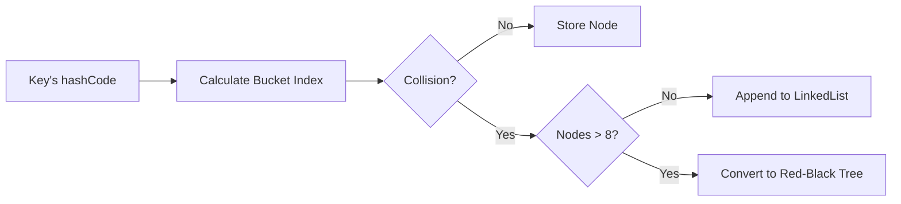
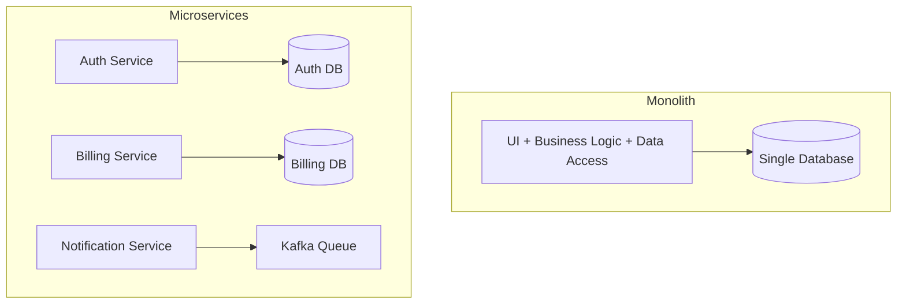
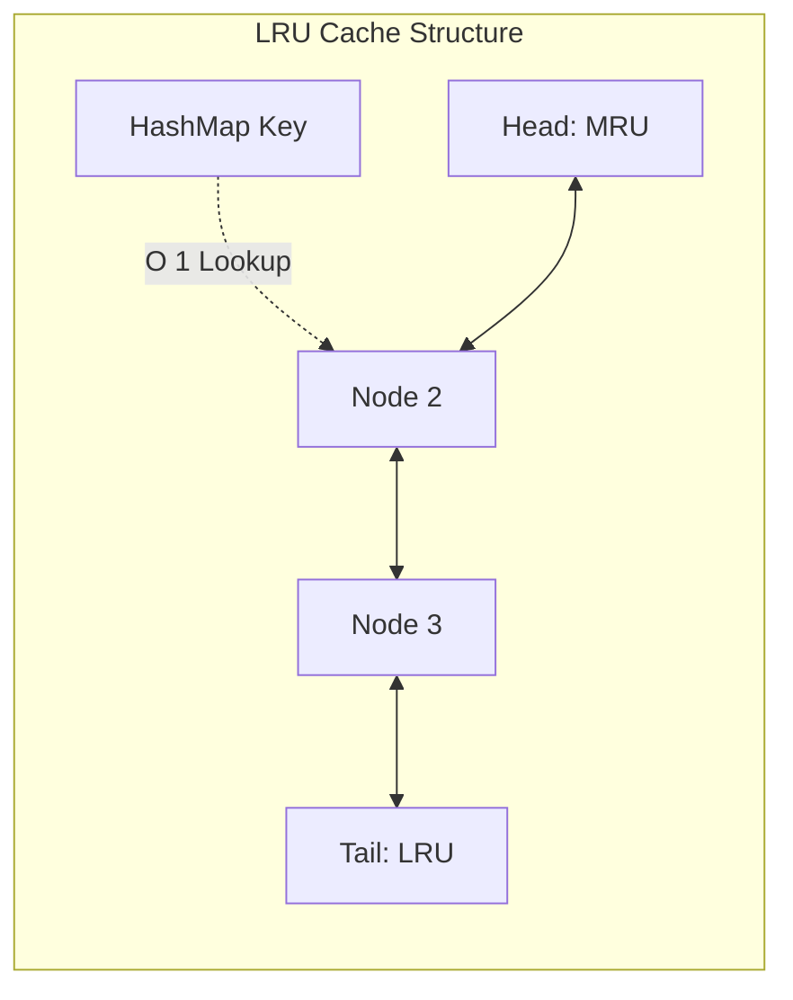
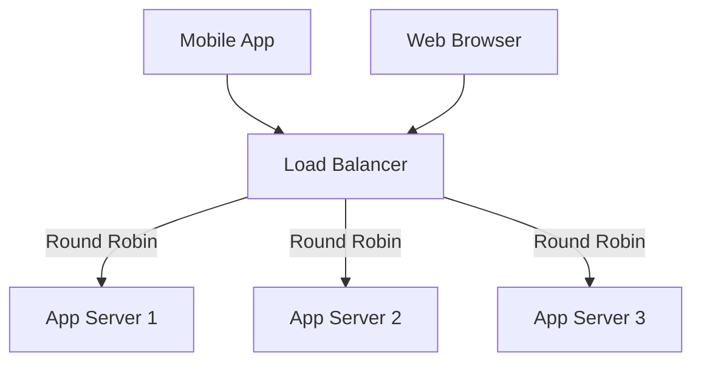
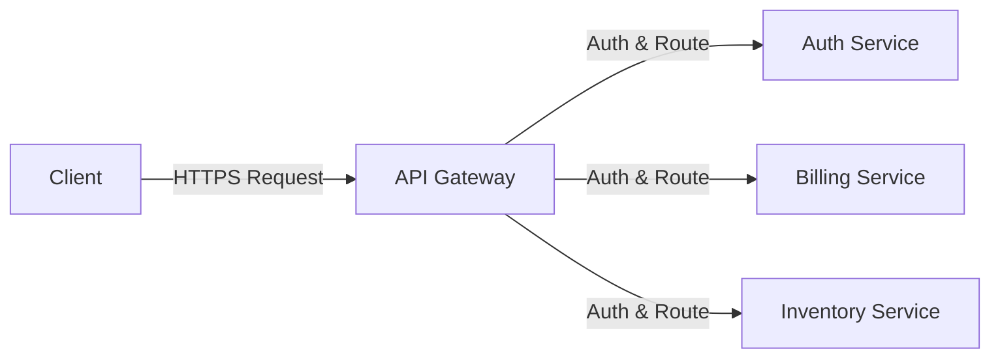

# BT Group Software Engineering Professional - Interview Questions

> **Source:** BT Careers, Glassdoor, and General Tech Telecommunication Interviews.
> **Focus:** Core Java, Networking, System Design, DSA, and BT Core Values.
> **Format:** Ordered strictly by frequency.

---

### Q1. 🔴 🌐 Explain the internal working of `HashMap` in Java.
**Answer:** The `HashMap` operates on the principle of hashing, utilizing an array of nodes (buckets) to store key-value pairs. 
- **Hash Calculation:** When an element is inserted, the key's `hashCode()` determines the exact bucket index.
- **Collision Handling:** If multiple keys hash to the same bucket, Java handles the collision by chaining them together.
- **Java 8 Optimization:** To prevent performance degradation during severe collisions, a bucket automatically upgrades from a **LinkedList** to a **Red-Black Tree** once the `TREEIFY_THRESHOLD` of 8 is crossed, improving worst-case search time from `O(N)` to `O(log N)`.

### Q2. 🔴 🌐 What is the difference between `HashMap` and `ConcurrentHashMap`?
**Answer:** The primary difference lies in thread safety and locking mechanisms:
- **`HashMap`:** Inherently **not thread-safe** and can cause infinite loops during concurrent resizing.
- **`ConcurrentHashMap` (Java 8+):** Designed for multithreading. It abandons segment-level locking in favor of **Compare-And-Swap (CAS)** operations at the node level. This allows multiple threads to read and write to different buckets simultaneously without locking the entire map, ensuring high concurrency without performance bottlenecks.

### Q3. 🔴 🌐 Explain the four pillars of OOPs with examples.
**Answer:** The four fundamental concepts of Object-Oriented Programming are:
1. **Encapsulation:** Shielding the internal state (e.g., keeping fields `private` and exposing only controlled `public` getters/setters).
2. **Abstraction:** Hiding complexity behind simple interfaces (e.g., calling `process()` on a `PaymentProcessor` without knowing its internal implementation).
3. **Inheritance:** Promoting code reuse by allowing child classes to inherit properties from a parent class (e.g., `Admin` inheriting from `User`).
4. **Polymorphism:** The ability to treat objects as their parent type, permitting generic code execution across multiple implementations via **method overriding** (runtime) or **method overloading** (compile-time).

### Q4. 🔴 🌐 How does Java 8 Streams API work?
**Answer:** The Streams API introduces a functional, declarative approach to processing collections. 
- **Declarative Pipeline:** Enables chaining operations like `filter` and `map` without mutating the underlying data.
- **Lazy Evaluation:** Intermediate operations are not executed until a terminal operation (like `collect`) is invoked, allowing the JVM to heavily optimize the pipeline.
- **Parallel Processing:** Massive datasets can be processed concurrently with zero boilerplate by switching to `parallelStream()`.

### Q5. 🔴 🌐 What is the difference between Monolithic and Microservices architecture?
**Answer:** The difference fundamentally comes down to scale, deployment, and agility:
- **Monolith:** Bundles the entire application (UI, business logic, database access) into a single deployable artifact. It is simple to start with, but a single bug can crash the entire system, and scaling requires replicating the whole application.
- **Microservices:** Decouples the domain into small, independent services communicating over REST or message queues. This allows discrete teams to deploy, scale, and manage services independently.

### Q6. 🔴 🌐 What are the SOLID Principles?
**Answer:** SOLID principles prevent software architecture from degrading into unmaintainable code over time:
- **Single Responsibility:** A class should have only one reason to change.
- **Open/Closed:** Software entities should be open for extension but closed for modification.
- **Liskov Substitution:** Subtypes must be seamlessly substitutable for their base types without breaking application logic.
- **Interface Segregation:** Multiple small, client-specific interfaces are preferable to one massive general-purpose interface.
- **Dependency Inversion:** High-level modules should depend on abstractions (interfaces), never on concrete implementations.

### Q7. 🟠 🌐 Explain runtime and compile-time polymorphism.
**Answer:** 
- **Compile-time polymorphism (Static Binding):** Achieved through **method overloading**, where multiple methods share the same name but have different parameter signatures. The compiler resolves the exact method call.
- **Runtime polymorphism (Dynamic Binding):** Achieved through **method overriding**. A parent reference points to a child object, and the JVM resolves which overridden method to execute at runtime based on the actual object type.

### Q8. 🟠 🌐 What is a copy constructor and when is it used?
**Answer:** A **copy constructor** is a special constructor used to create a new object as an exact replica of an existing object of the same class. 
- **Usage:** It is primarily used to perform a **deep copy** of an object.
- **Advantage:** Unlike `Object.clone()`, which can be error-prone and requires casting, a copy constructor explicitly safely copies state, ensuring that mutable internal references are not unintentionally shared between the original and the clone.

### Q9. 🟠 🌐 Why do you want to work for BT Group?
**Answer:** Key points to address when answering:
- **Scale and Impact:** Highlight BT's position as a global leader in telecommunications and digital infrastructure.
- **Technical Alignment:** Emphasize a desire to work on systems requiring high availability, low latency, and massive scale.
- **Cultural Fit:** Connect personal engineering principles to BT's core value of **Pride**—taking ownership of writing resilient code that powers connectivity for millions.

### Q10. 🟠 🌐 Can you walk me through the logic of a Least Recently Used (LRU) cache?
**Answer:** An LRU cache requires `O(1)` lookups and `O(1)` evictions, optimally implemented using a combination of a **HashMap** and a **Doubly Linked List**.
- **HashMap:** Maps keys directly to their corresponding nodes in the linked list for instant access.
- **Doubly Linked List:** Maintains the access order. 
- **Mechanism:** Whenever an item is read or written, its node is moved to the **head** (most recently used). When capacity is reached, the node at the **tail** (least recently used) is evicted.

### Q11. 🟠 🌐 Explain the advantages of using a Virtual Private Network (VPN).
**Answer:** In enterprise networking, a VPN establishes a highly secure, **encrypted tunnel** over an insecure public network. 
- **Data Integrity and Confidentiality:** Encrypts payloads, preventing man-in-the-middle attacks and data interception.
- **Anonymity:** Masks the user's IP address.
- **Secure Access:** Securely bridges remote devices into the corporate intranet, acting as if they were physically connected to the internal network.

### Q12. 🟠 🌐 Tell me about a time you had to overcome a difficult challenge. (BT Core Value: Change)
**Answer:** When answering, use the **STAR method** (Situation, Task, Action, Result) to demonstrate adaptability:
- **Scenario:** Describe a situation where requirements drastically shifted mid-project (e.g., migrating an authentication protocol right before launch).
- **Action:** Highlight proactive steps taken to analyze the impact, lead refactoring efforts (like using the adapter pattern), and communicate with stakeholders.
- **Result:** Emphasize that embracing change proactively is essential for delivering robust software on time.

### Q13. 🟠 🌐 Describe a situation where you went above and beyond for a customer. (BT Core Value: Customer)
**Answer:** Focus on proactive problem-solving and customer-centric engineering:
- **Scenario:** Identifying a performance bottleneck (e.g., API timeouts on slow networks) before formal customer complaints were raised.
- **Action:** Taking the initiative to implement an optimization, such as a localized caching layer.
- **Result:** Detail the measurable positive impact (e.g., 80% reduction in response time) and how it improved the end-user experience.

### Q14. 🟠 🌐 Explain Garbage Collection in Java.
**Answer:** Garbage Collection is the JVM's automated process of managing memory by identifying and destroying unreachable objects.
- **G1GC (Garbage-First):** Partitions the heap into regions and aggressively collects regions with the most garbage to maintain predictable, low-latency pause times.
- **ZGC:** A scalable, ultra-low-latency collector that performs almost all of its work concurrently, keeping pause times in the sub-millisecond range.

### Q15. 🟠 🌐 What are ACID properties?
**Answer:** ACID properties strictly enforce data integrity in transactional databases:
- **Atomicity:** The transaction is a single unit of work; if one step fails, the entire transaction rolls back completely.
- **Consistency:** The database state must strictly transition from one valid state to another, upholding all constraints.
- **Isolation:** Concurrent transactions execute independently without interfering with one another, preventing dirty reads.
- **Durability:** Once a transaction is committed, it is permanently persisted, even in the event of immediate system failure.

### Q16. 🟠 🌐 What is the N+1 Query Problem in Hibernate?
**Answer:** The N+1 problem is a severe performance anti-pattern. 
- **The Issue:** It occurs when an ORM executes 1 query to fetch a list of parent entities, and then fires N additional queries to lazily load their associated child entities.
- **The Solution:** Instruct the ORM to fetch the parent and children in a single, optimized SQL query using the **`JOIN FETCH`** keyword in JPQL or by applying Spring's **`@EntityGraph`**.

### Q17. 🟠 🌐 Two Sum Problem.
**Answer:** The algorithmic challenge requires finding the indices of two numbers in an array that add up to a target. 
- **Optimal Approach:** Avoid nested loops (`O(N^2)`). Instead, iterate through the array once while utilizing a **HashMap**.
- **Execution:** Calculate the `complement` (Target - Current Element). If it exists in the map, the pair is found. Otherwise, store the current element and its index. This trades `O(N)` space for a highly efficient **O(N)** time complexity.

### Q18. 🟠 🌐 Palindrome Check (String or Linked List).
**Answer:** 
- **String Approach:** Utilize the **two-pointer technique**. Initialize pointers at the start and end, advancing them inward. A mismatch immediately returns false (`O(N)` time, `O(1)` space).
- **Linked List Approach:** Use the **Fast and Slow pointer** strategy to locate the exact middle node. Reverse the second half of the list in-place, and then sequentially compare the two halves node by node.

### Q19. 🟡 🌐 What is the difference between `String`, `StringBuilder`, and `StringBuffer`?
**Answer:** 
- **`String`:** Completely immutable; any modification creates a new object, which can strain the garbage collector.
- **`StringBuilder`:** Highly efficient and mutable, making it the default choice for dynamic string concatenation. However, it is **not thread-safe**.
- **`StringBuffer`:** Mutable and thread-safe. Its methods are synchronized, which incurs a performance overhead, making it suitable only when string builders must be shared across threads.

### Q20. 🟡 🌐 Explain `@Transactional` propagation.
**Answer:** Transaction propagation dictates how a method behaves when invoked within or outside an existing transaction context.
- **`REQUIRED` (Default):** The method joins an active transaction if one exists; if not, it creates a new one. A failure rolls back the entire chain.
- **`REQUIRES_NEW`:** Forcefully suspends the current transaction, executes the method in a completely independent new transaction, and then resumes the original transaction.

### Q21. 🟡 🌐 Explain Database Indexing (B-Tree).
**Answer:** Indexing prevents inefficient, massive table scans (`O(N)`).
- **Mechanism:** Placing an index on a column causes the database to construct a **B-Tree (Balanced Tree)** data structure.
- **Advantage:** Keeps the data logically sorted, ensuring that `SELECT`, `INSERT`, and `DELETE` operations locate rows in highly efficient logarithmic time (**O(log N)**).
- **Trade-off:** Every index adds write-overhead during data insertion/modification.

### Q22. 🟡 🌐 How does Load Balancing work in a distributed system?
**Answer:** A Load Balancer ensures high availability by sitting in front of backend servers and dynamically routing incoming client traffic.
- **Purpose:** Distributes load to prevent any single server from becoming a bottleneck and routing around failed instances.
- **Algorithms:** Includes **Round Robin** (equal distribution), **Least Connections** (routes to the server with the fewest active connections), and **IP Hashing**.

### Q23. 🟡 🌐 Reverse a Linked List.
**Answer:** Reversing a linked list requires manipulating pointers entirely in-place to achieve `O(N)` time and `O(1)` space complexity.
- **Algorithm:** Maintain three pointers: `prev` (initially null), `current`, and `next`. 
- **Execution:** During traversal, temporarily store `current.next`, redirect `current.next` to point backwards to `prev`, and shift all three pointers one step forward until the list ends.

### Q24. 🟡 🌐 Detect Cycle in Linked List (Floyd's).
**Answer:** **Floyd’s Cycle-Finding Algorithm** elegantly detects loops without requiring extra memory (`O(N)` time, `O(1)` space).
- **Algorithm:** Deploy two pointers. The 'slow' pointer advances one step at a time, while the 'fast' pointer leaps two steps.
- **Result:** If the list is acyclic, the fast pointer hits `null`. If a cycle exists, the fast pointer will mathematically lap the slow pointer, resulting in a collision.

### Q25. 🟡 🌐 What is an API Gateway?
**Answer:** An API Gateway serves as the single, centralized entry point for all client requests in a microservices architecture, abstracting backend complexity.
- **Routing:** Dynamically routes external requests to the correct internal microservice IP.
- **Security:** Validates JWT tokens and enforces authentication.
- **Resilience:** Enforces strict rate-limiting to prevent DDoS attacks and handles cross-cutting concerns like logging and load balancing.

### Q26. 🟡 🌐 Explain the Saga Pattern.
**Answer:** The Saga Pattern manages data consistency across distributed microservices where traditional ACID transactions (two-phase commits) are too slow or impossible.
- **Mechanism:** Global transactions are broken into a sequence of localized transactions.
- **Failure Handling:** If a step fails, the system triggers automated **compensating transactions** to explicitly undo the work completed in preceding steps, ensuring eventual consistency without holding distributed locks.

### Q27. 🟢 🌐 What is the difference between TCP and UDP?
**Answer:** 
- **TCP (Transmission Control Protocol):** A connection-oriented protocol that establishes a formal handshake. It guarantees reliable, ordered, and error-checked delivery of packets, making it ideal for REST APIs and file transfers.
- **UDP (User Datagram Protocol):** A connectionless protocol that transmits packets quickly without guaranteeing delivery, order, or error-checking. It prioritizes ultra-low latency, making it essential for real-time applications like VoIP or video streaming.

### Q28. 🟢 🌐 Explain CompletableFuture and asynchronous programming.
**Answer:** **`CompletableFuture`** enables fully non-blocking asynchronous programming in Java. 
- **Functionality:** It avoids blocking threads while waiting for I/O tasks by allowing developers to attach callbacks (e.g., `.thenApply()`, `.thenAccept()`).
- **Advantage:** Facilitates fanning-out multiple API calls in parallel and robustly combining their results, thereby maximizing CPU utilization and system responsiveness.

### Q29. 🟢 🌐 What is the difference between `wait()` and `sleep()`?
**Answer:** The distinction lies in lock management and thread safety:
- **`wait()`:** A method of the `Object` class used for inter-thread synchronization. When called, the thread immediately surrenders its lock, allowing other threads to proceed.
- **`sleep()`:** A utility of the `Thread` class that pauses execution for a set duration but **retains all locks** it currently holds. It should not be used inside synchronized blocks in production code.

### Q30. 🟢 🌐 Describe a time you worked in a high-performing team. (BT Core Value: Team)
**Answer:** When answering, highlight cross-functional collaboration and clear communication:
- **Scenario:** Detail a high-stakes project (e.g., migrating a legacy monolith under a tight deadline).
- **Key Factors:** Emphasize the importance of psychological safety—resolving architectural disagreements constructively by evaluating trade-offs rather than letting egos dominate.
- **Result:** Conclude that a unified, communicative team supported by robust processes (like solid CI/CD pipelines) consistently outperforms isolated individual contributors.
