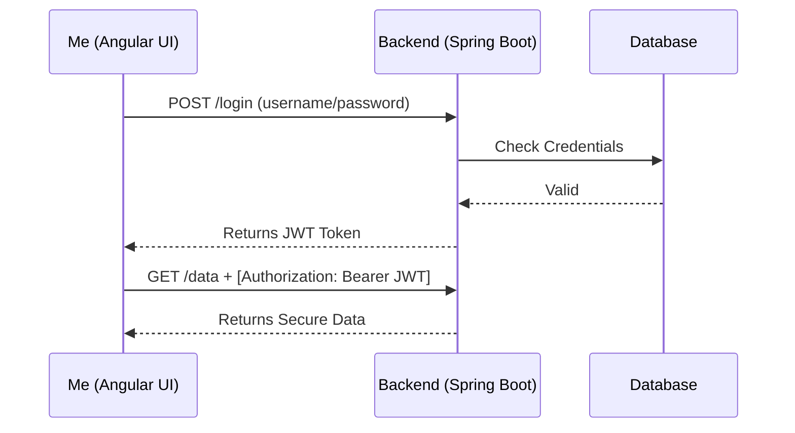
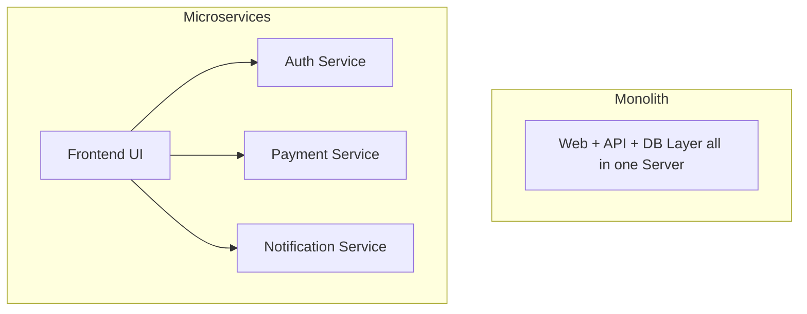
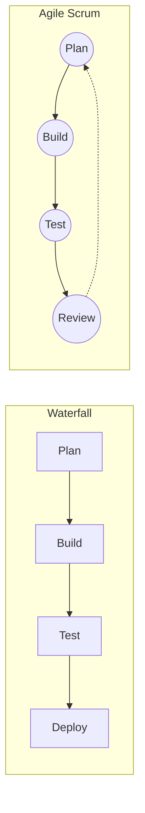

# Experion Technologies - Interview Questions & Answers

**Q1. Interviewer:** *"I see on your resume that you slashed report generation time from 10 seconds to 2 seconds. How did you fix this?"*

**Candidate:** 
"I found two main issues:
1. **The N+1 Query Problem:** Hibernate was running hundreds of queries. I fixed this by using `JOIN FETCH` to load everything in one single query.
2. **Missing Indexes:** The database was scanning the whole table. I added B-tree indexes to speed up the search.
I also used pagination and Redis caching so we didn't load too much data at once."

---

**Q2. Interviewer:** *"Can you explain how you handle application security and login between Angular and Spring Boot?"*

**Candidate:** 
"The process involves both Angular and the internal mechanics of Spring Security, specifically broken down into Authentication and Authorization.

**Phase 1: Authentication (Who are you?)**
1. **Login Request:** Angular sends the credentials (username/password) to the Spring Boot login endpoint.
2. **AuthenticationManager:** Spring Security intercepts this and creates an unauthenticated `Authentication` object (e.g., `UsernamePasswordAuthenticationToken`). This is passed to the `AuthenticationManager`.
3. **AuthenticationProvider:** The manager delegates to an `AuthenticationProvider` (typically `DaoAuthenticationProvider`). 
4. **UserDetailsService & PasswordEncoder:** The provider calls the `UserDetailsService` to load the `UserDetails` from the database. It then uses the `PasswordEncoder` to securely compare the hashed password in the DB with the provided password.
5. **JWT Generation:** If successful, we generate a signed **JWT (JSON Web Token)** containing the user's details and roles, and send it back to Angular.

**Phase 2: Authorization (What are you allowed to do?)**
6. **Angular Interceptor:** Angular stores the JWT securely. For every subsequent API call, an Angular HTTP Interceptor automatically attaches this JWT to the `Authorization: Bearer` header.
7. **OncePerRequestFilter:** On the Spring Boot side, a custom filter (extending `OncePerRequestFilter`) sits in front of the application. It intercepts the incoming request and extracts the JWT.
8. **Token Validation:** The filter validates the JWT's signature and expiration date.
9. **SecurityContextHolder:** If valid, the filter extracts the user's roles from the token, creates a fully authenticated `Authentication` object, and sets it in the `SecurityContextHolder`.
10. **FilterSecurityInterceptor / Method Security:** Finally, Spring Security's authorization mechanisms (like the `SecurityFilterChain` or method-level `@PreAuthorize` annotations) check the `SecurityContextHolder`. They verify if the authenticated user has the necessary roles to access the requested REST endpoint. If they do, access is granted; otherwise, a 403 Forbidden is returned."



---

**Q3. Interviewer:** *"What recent Java 21 features do you use the most?"*

**Candidate:** 
"I mainly use two features:
*   **Records:** They automatically create getters, setters, and equals methods, saving a lot of time when making DTOs.
*   **Virtual Threads:** These are lightweight threads that let the application handle thousands of users at the same time without using up all the computer's memory."

---

**Q4. Interviewer:** *"Why did you choose a Microservices architecture instead of a Monolith at ACT Fibernet?"*

**Candidate:** 
"Mainly for three reasons:
1. **Independent Scaling:** We could add more servers just for the payment service without copying the whole app.
2. **Fault Tolerance:** If the email service crashed, users could still log in and use the main app.
3. **Faster Updates:** My team could launch updates to our service without waiting for other teams."



---

**Q5. Interviewer:** *"How do you use Angular Interceptors, Directives, and RxJS?"*

**Candidate:** 
*   **Interceptors:** I use them to automatically attach JWT tokens to all outgoing requests.
*   **Directives:** I use `*ngIf` to show or hide things on the screen, and create custom directives for tooltips.
*   **RxJS:** I use `BehaviorSubject` to share data between different components, and `switchMap` to cancel old API calls if the user is typing fast in a search bar."

---

**Q6. Interviewer:** *"How do you make sure two users don't update the exact same payment record at the same time in Spring Boot?"*

**Candidate:** 
"I use **Optimistic Locking**. I add a `@Version` column to the database table. If two people read the record and try to save it at the same time, the first one succeeds. For the second person, Hibernate notices the version changed and throws an error, preventing them from overwriting the data."

---

**Q7. Interviewer:** *"What is the difference between an INNER JOIN and a LEFT JOIN in SQL? When would you use a LEFT JOIN?"*

**Candidate:** 
*   **INNER JOIN:** Only shows results if there is matching data in *both* tables.
*   **LEFT JOIN:** Shows *everything* from the first table, even if there is no match in the second table.
*   **Scenario:** If I need a list of *all* Departments (Left table), even the newly created ones that have zero Employees (Right table), I must use a LEFT JOIN. An INNER JOIN would hide the empty departments."

---

**Q8. Interviewer:** *"What is the difference between a Stack and a Queue?"*

**Candidate:** 
"A **Stack** is Last In, First Out (LIFO). The last item added is the first one removed. Like an 'Undo' button in Word.
A **Queue** is First In, First Out (FIFO). The first item added is the first one processed. Like waiting in line at a store, or processing a list of background emails."

---

**Q9. Interviewer:** *"Why does the industry prefer Agile Scrum over the old Waterfall model?"*

**Candidate:** 
"Waterfall is too rigid. You plan everything for months, and it's hard to change if the client changes their mind. 
Agile Scrum is flexible. We work in short 2-week sprints, show the software to the client constantly, and easily make changes based on their feedback."



---

**Q10. Interviewer:** *"How do you deploy your Java and Angular apps using CI/CD and Docker?"*

**Candidate:** 
"When we push code to the main branch, our CI/CD tool (like GitHub Actions) does this automatically:
1. Runs all our automated tests.
2. Builds the Spring Boot `.jar` and the Angular files.
3. Puts them inside Docker images.
4. Sends the new Docker containers to our server (like AWS) and replaces the old ones without the website going down."

---

**Q11. Interviewer:** *"Have you used AWS Cloud services like S3 or CloudWatch?"*

**Candidate:** 
"Yes. I use **AWS S3** for file storage, like saving user profile pictures or PDF files. 
I use **AWS CloudWatch** for monitoring. It watches our app's CPU usage and sends us an alert if the server crashes."

---

**Q12. Interviewer:** *"What is the difference between functional and non-functional testing?"*

**Candidate:** 
"**Functional testing** checks if a feature works correctly. Like, does the login button actually log you in? We test this with JUnit.
**Non-functional testing** checks performance. Like, can the login button handle 1,000 users clicking it at the exact same time without crashing?"

---

**Q13. Interviewer:** *"Are you familiar with SOLID principles for writing clean code?"*

**Candidate:** 
"Yes. For example, I heavily use the **Single Responsibility Principle**. My Controllers only handle web routing, my Services only handle business logic, and my Repositories only talk to the database. This keeps the code clean and easy to test."

---

**Q14. Interviewer:** *"How do you handle a junior developer writing messy code in a Pull Request?"*

**Candidate:** 
"I don't just reject it. I leave a polite comment explaining *why* it's inefficient and suggest a better way. If they are really stuck, I will jump on a quick call and pair-program with them so they actually learn how to fix it for next time."

---

**Q15. Interviewer:** *"How does a HashMap work internally in Java?"*

**Candidate:** 
"A `HashMap` uses an array of 'buckets'. When you add a key-value pair:
1. It calculates a hash code for the key.
2. It uses that hash to find the right bucket in the array.
3. If two keys get the same bucket (a collision), it stores them in a LinkedList (or a balanced tree if it gets too large) inside that bucket.
When retrieving, it hashes the key again to find the bucket, then searches the list/tree for the exact match."

---

**Q16. Interviewer:** *"When would you choose a LinkedList over an ArrayList?"*

**Candidate:** 
"I almost always use `ArrayList` because reading data is very fast (O(1)). But I would choose a `LinkedList` if I need to constantly add or remove items from the *middle or beginning* of a massive list. 
In an `ArrayList`, inserting in the middle forces all other elements to shift over, which is slow. In a `LinkedList`, it just updates the pointers of the neighboring nodes."

---

**Q17. Interviewer:** *"Can you explain what the Java 8 Stream API is and give a quick example?"*

**Candidate:** 
"Streams let us process collections of data in a functional, declarative way without writing loops. 
For example, if I have a list of employees and I only want the names of those who earn more than $50k, I can do:
`employees.stream().filter(e -> e.salary > 50000).map(e -> e.name).collect(Collectors.toList());`
It makes the code much cleaner and easier to read."

---

**Q18. Interviewer:** *"Since you work with microservices and concurrency, what is the difference between `Hashtable`, `Collections.synchronizedMap`, and `ConcurrentHashMap`?"*

**Candidate:** 
"All three are thread-safe, but `ConcurrentHashMap` is much faster. 
`Hashtable` and `synchronizedMap` lock the *entire* map every time one thread reads or writes to it, which creates a huge bottleneck.
`ConcurrentHashMap` only locks the specific *segment* (or bucket) being updated, allowing many threads to read and write to different parts of the map at the exact same time."

---

**Q19. Interviewer:** *"Can you write a quick Java 8 code snippet to find the frequency of each character in a given String?"*

**Candidate:** 
"Absolutely. We can achieve this cleanly using the Stream API and `Collectors.groupingBy`:
```java
String input = "experion";
Map<String, Long> frequency = Arrays.stream(input.split(""))
    .collect(Collectors.groupingBy(c -> c, Collectors.counting()));
System.out.println(frequency);
```
This splits the string into characters, groups them by themselves, and counts the occurrences."

---

**Q20. Interviewer:** *"How would you find the second highest number in an integer array without sorting it first?"*

**Candidate:** 
"I would iterate through the array once (O(N) time complexity) while keeping track of the highest and second-highest numbers:
```java
int highest = Integer.MIN_VALUE;
int secondHighest = Integer.MIN_VALUE;

for (int num : arr) {
    if (num > highest) {
        secondHighest = highest;
        highest = num;
    } else if (num > secondHighest && num != highest) {
        secondHighest = num;
    }
}
```
This is much more efficient than using `Arrays.sort()` which takes O(N log N) time."

---

**Q21. Interviewer:** *"Write a method to check if a given string is a palindrome."*

**Candidate:** 
"The most efficient way is to use a two-pointer approach, checking characters from the outside in (O(N/2) time):
```java
public boolean isPalindrome(String str) {
    int left = 0;
    int right = str.length() - 1;
    while (left < right) {
        if (str.charAt(left) != str.charAt(right)) {
            return false;
        }
        left++;
        right--;
    }
    return true;
}
```
Alternatively, for a quick one-liner, I could use `new StringBuilder(str).reverse().toString().equals(str)`, but the two-pointer method is better for performance because it doesn't create extra string objects."

---

**Q22. Interviewer:** *"Explain the 'Two Sum' problem. Given an array of integers and a target sum, how do you find the two numbers that add up to the target?"*

**Candidate:** 
"The naive approach uses nested loops and takes O(N^2) time, which is too slow. 
The optimal approach takes O(N) time using a `HashMap`. As I iterate through the array, I calculate the 'difference' needed to reach the target sum. I check if that difference is already in the map. If it is, we found the pair. If not, I store the current number in the map and move on:
```java
public int[] twoSum(int[] nums, int target) {
    Map<Integer, Integer> map = new HashMap<>();
    for (int i = 0; i < nums.length; i++) {
        int diff = target - nums[i];
        if (map.containsKey(diff)) {
            return new int[] { map.get(diff), i };
        }
        map.put(nums[i], i);
    }
    return new int[]{};
}
```
"

---

**Q23. Interviewer:** *"How do you monitor the health of a Spring Boot application in production?"*

**Candidate:** 
"I use **Spring Boot Actuator**. By including the actuator dependency, it automatically exposes endpoints like `/actuator/health`, `/actuator/metrics`, and `/actuator/info`. These can be integrated with monitoring tools like Prometheus and Grafana to track memory usage, DB status, and application uptime."

---

**Q24. Interviewer:** *"How do you manage different configurations for Development, QA, and Production environments?"*

**Candidate:** 
"I use **Spring Profiles**. I create separate properties files like `application-dev.yml` and `application-prod.yml`. When starting the server or Docker container, I pass the active profile via the command line or environment variable (`-Dspring.profiles.active=prod`), which tells Spring which configuration to load."

---

**Q25. Interviewer:** *"How do you handle exceptions globally in a Spring Boot REST API?"*

**Candidate:** 
"I use the `@ControllerAdvice` and `@ExceptionHandler` annotations. This allows me to intercept any exception thrown across all controllers in one central class. I can then map the exception to a standard custom error response (like a JSON object containing an error code, message, and timestamp) and return the appropriate HTTP status code, like 404 for `ResourceNotFoundException`."

---

**Q26. Interviewer:** *"What is the difference between Constructor Injection and Setter Injection in Spring? Which do you prefer?"*

**Candidate:** 
"**Constructor Injection** passes dependencies through the constructor. **Setter Injection** uses setter methods. 
I strongly prefer Constructor Injection because it allows fields to be marked as `final` (making them immutable), and it ensures the bean cannot be instantiated without its required dependencies, preventing `NullPointerException`s at runtime."

---

**Q27. Interviewer:** *"How do you improve the initial load time of a large Angular application?"*

**Candidate:** 
"I use **Lazy Loading**. Instead of loading the entire application bundle at once, I configure the Angular Router to only load the modules needed for the specific route the user is visiting. This drastically reduces the initial JavaScript payload size."

---

**Q28. Interviewer:** *"How do you prevent unauthorized users from accessing certain pages in Angular?"*

**Candidate:** 
"I use **Route Guards**, specifically the `CanActivate` guard. Before the router navigates to a protected route, the guard checks an authentication service (e.g., verifying if a valid JWT exists). If unauthorized, the guard returns `false` and redirects the user to the login page."

---

**Q29. Interviewer:** *"What is the difference between a Promise and an Observable in Angular/TypeScript?"*

**Candidate:** 
"A **Promise** handles a single asynchronous event and cannot be cancelled once started. 
An **Observable** (from RxJS) can handle a continuous stream of events over time. It can be cancelled (unsubscribed), and it provides powerful operators like `map`, `filter`, and `debounceTime` to transform data before it reaches the component."

---

**Q30. Interviewer:** *"What is the difference between `var`, `let`, and `const` in JavaScript/TypeScript?"*

**Candidate:** 
*   `var` is function-scoped and can be hoisted, which often leads to unpredictable bugs.
*   `let` is block-scoped (only exists within `{}`) and can be reassigned.
*   `const` is also block-scoped but cannot be reassigned (though if it's an object, its properties can still be modified)."

---

**Q31. Interviewer:** *"How does Garbage Collection work in Java?"*

**Candidate:** 
"Java automatically manages memory. The Garbage Collector (GC) runs in the background, looking for objects in the Heap memory that no longer have any active references pointing to them. When it finds them, it reclaims that memory. Modern Java uses algorithms like G1GC or ZGC to minimize application pauses during collection."

---

**Q32. Interviewer:** *"What is the difference between a `Runnable` and a `Callable` in Java multithreading?"*

**Candidate:** 
"Both are interfaces used to execute code on a separate thread. 
However, a `Runnable`'s `run()` method returns `void` and cannot throw checked exceptions. 
A `Callable`'s `call()` method returns a result (a `Future`) and is allowed to throw checked exceptions."

---

**Q33. Interviewer:** *"Why should you use an `ExecutorService` instead of manually creating `new Thread()`?"*

**Candidate:** 
"Creating a new OS thread is an expensive operation. An `ExecutorService` manages a **Thread Pool**—a set of reusable threads. Instead of creating a new thread for every task, tasks are placed in a queue and processed by the available pooled threads, vastly improving application performance and preventing memory exhaustion."

---

**Q34. Interviewer:** *"What is the difference between Checked and Unchecked Exceptions in Java?"*

**Candidate:** 
"**Checked Exceptions** (like `IOException`) are checked at compile-time. The compiler forces you to either catch them or declare them in the method signature.
**Unchecked Exceptions** (like `NullPointerException` or `RuntimeException`) occur at runtime and are not enforced by the compiler. They usually indicate a programming flaw rather than an expected environment failure."

---

**Q35. Interviewer:** *"Explain Method Overloading vs. Method Overriding."*

**Candidate:** 
*   **Overloading (Compile-time Polymorphism):** Having multiple methods in the *same class* with the same name but different parameters (different type or number of arguments).
*   **Overriding (Run-time Polymorphism):** When a subclass provides a specific implementation for a method that is already defined in its parent class (using the `@Override` annotation)."

---

**Q36. Interviewer:** *"Since Java 8 introduced default methods in Interfaces, what is the main difference between an Abstract Class and an Interface?"*

**Candidate:** 
"Even with default methods, a class can implement **multiple** interfaces, but it can only extend **one** abstract class. Furthermore, abstract classes can hold state (instance variables/constructors), whereas interfaces can only have constants (`public static final`)."

---

**Q37. Interviewer:** *"What are the ACID properties in database transactions?"*

**Candidate:** 
*   **Atomicity:** The entire transaction succeeds, or it completely rolls back. (All or nothing).
*   **Consistency:** The database remains in a valid state before and after the transaction.
*   **Isolation:** Concurrent transactions don't interfere with each other.
*   **Durability:** Once committed, the changes are permanent, even if the database crashes."

---

**Q38. Interviewer:** *"What is Database Normalization and why is it important?"*

**Candidate:** 
"Normalization is the process of organizing data to reduce redundancy and improve data integrity. 
*   **1NF:** Ensures each column has atomic (indivisible) values and a primary key.
*   **2NF:** Removes partial dependencies (attributes depend on the *whole* primary key).
*   **3NF:** Removes transitive dependencies (non-key columns shouldn't depend on other non-key columns). It saves storage and prevents update anomalies."

---

**Q39. Interviewer:** *"What happens if you have a 'Dirty Read' in a database?"*

**Candidate:** 
"A Dirty Read happens when Transaction A reads data that Transaction B has modified but *has not yet committed*. If Transaction B rolls back, Transaction A is now using invalid, non-existent data. We prevent this by setting the transaction isolation level to at least `READ COMMITTED`."

---

**Q40. Interviewer:** *"What is the purpose of an API Gateway in a Microservices architecture?"*

**Candidate:** 
"An API Gateway acts as a single entry point for all frontend requests. It prevents the frontend from having to know the IPs of 50 different microservices. It handles routing, load balancing, global authentication (like validating JWTs), rate limiting, and CORS."

---

**Q41. Interviewer:** *"Can you explain the CAP Theorem?"*

**Candidate:** 
"The CAP theorem states that a distributed database can only guarantee two out of three characteristics:
*   **Consistency:** Every read receives the most recent write.
*   **Availability:** Every request receives a non-error response.
*   **Partition Tolerance:** The system continues to operate despite network failures dropping messages between nodes.
Since network failures (Partitions) are inevitable, systems usually have to choose between CP (Consistency) or AP (Availability)."

---

**Q42. Interviewer:** *"How do you trace a request that fails after traveling through 4 different microservices?"*

**Candidate:** 
"I use distributed tracing tools like **Spring Cloud Sleuth** and **Zipkin**. Sleuth assigns a unique `Trace ID` to the initial request, which gets passed in the HTTP headers to all downstream services. I can then search that single Trace ID in Zipkin to see exactly how long each service took and exactly where the error occurred."

---

**Q43. Interviewer:** *"What is the difference between a Dockerfile and docker-compose?"*

**Candidate:** 
"A `Dockerfile` contains the instructions to build a single Docker image (e.g., installing Java and copying the Spring Boot `.jar`). 
`docker-compose` is a YAML file used to run and connect *multiple* containers at once. For example, spinning up the Spring Boot app, an Angular frontend container, and a PostgreSQL database container on a shared network with one command."

---

**Q44. Interviewer:** *"In Kubernetes, what is the difference between a Pod and a Service?"*

**Candidate:** 
"A **Pod** is the smallest deployable unit, containing one or more Docker containers. Pods are ephemeral; if they crash, K8s destroys them and creates a new one with a different IP.
A **Service** provides a stable, permanent IP address and DNS name. It acts as a load balancer, routing traffic to the healthy Pods behind it, so other applications don't have to worry about Pod IPs changing."

---

**Q45. Interviewer:** *"When using Git, what is the difference between `git merge` and `git rebase`?"*

**Candidate:** 
"Both combine branches. 
`git merge` takes the feature branch and ties it into the main branch with a new 'merge commit'. It preserves the exact history but can create a messy, web-like git log.
`git rebase` takes your feature branch commits and reapplies them sequentially on top of the main branch. It creates a perfectly straight, clean history, but rewrites commit hashes."

---

**Q46. Interviewer:** *"Can you write a thread-safe Singleton class in Java?"*

**Candidate:** 
"Yes, the most efficient way is using double-checked locking:
```java
public class Singleton {
    private static volatile Singleton instance;
    private Singleton() {} // Private constructor

    public static Singleton getInstance() {
        if (instance == null) {
            synchronized(Singleton.class) {
                if (instance == null) {
                    instance = new Singleton();
                }
            }
        }
        return instance;
    }
}
```
The `volatile` keyword ensures memory visibility across threads."

---

**Q47. Interviewer:** *"What is the difference between the Factory Pattern and the Builder Pattern?"*

**Candidate:** 
"Both are creational patterns.
The **Factory Pattern** is used when you need to create a single instance of a class that belongs to a family (like creating a `Car` or `Truck` based on a string input).
The **Builder Pattern** is used to construct a single, highly complex object step-by-step, especially when the object has many optional parameters, preventing a massive constructor with 10 arguments."

---

**Q48. Interviewer:** *"Write a method to reverse a Linked List."*

**Candidate:** 
"We need to keep track of previous, current, and next nodes in a single pass (O(N) time):
```java
public ListNode reverseList(ListNode head) {
    ListNode prev = null;
    ListNode current = head;
    
    while (current != null) {
        ListNode nextTemp = current.next; // Save next
        current.next = prev;              // Reverse pointer
        prev = current;                   // Move prev forward
        current = nextTemp;               // Move current forward
    }
    return prev; // New head
}
```
"

---

**Q49. Interviewer:** *"How does Binary Search work and what is its time complexity?"*

**Candidate:** 
"Binary Search works on a *sorted* array. It repeatedly divides the search interval in half. If the target value is less than the middle element, it narrows the search to the lower half. Otherwise, it searches the upper half. 
Because it halves the dataset every step, the time complexity is **O(log N)**, making it vastly faster than a linear search for large datasets."

---

**Q50. Interviewer:** *"Write a quick Java snippet to perform a Binary Search."*

**Candidate:** 
"Here is the iterative approach:
```java
public int binarySearch(int[] arr, int target) {
    int left = 0, right = arr.length - 1;
    while (left <= right) {
        int mid = left + (right - left) / 2; // Prevents integer overflow
        if (arr[mid] == target) return mid;
        if (arr[mid] < target) left = mid + 1;
        else right = mid - 1;
    }
    return -1; // Not found
}
```
"
