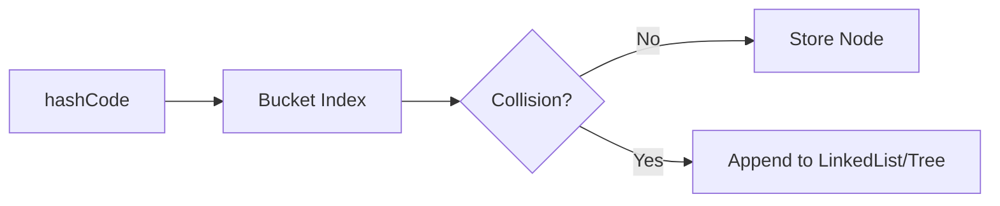

# Infosys Senior Java Full Stack Developer - Interview Questions (Top 50)

> **Source:** Aggregated from PrepInsta, AmbitionBox, GeeksforGeeks, and Reddit.
> **Focus:** Core Java, Spring Boot, Microservices, System Architecture, Database, and Angular/React.
> **Format:** Ordered by frequency.

---

### Q1. 🔴 🏬 Explain the internal working of `HashMap` in Java.
**Answer:**
- **Mechanism:** `HashMap` uses an array of nodes (buckets) to store key-value pairs based on hashing.
- **Index Calculation:** The key's `hashCode()` determines the bucket index.
- **Collision Handling:** If multiple keys map to the same bucket, they form a Linked List.
- **Java 8 Optimization:** Once a bucket exceeds `TREEIFY_THRESHOLD` (8), it transforms into a Red-Black Tree to improve worst-case search time from O(N) to O(log N).

| Java Version | Data Structure on Collision | Worst-case Time |
|--------------|-----------------------------|-----------------|
| < Java 8     | Linked List                 | O(N)            |
| >= Java 8    | Red-Black Tree              | O(log N)        |



### Q2. 🔴 🏬 What is the difference between `HashMap` and `ConcurrentHashMap`?
**Answer:**
- **Thread Safety:** `HashMap` is not thread-safe; `ConcurrentHashMap` is built for multithreading.
- **Locking Mechanism:** In Java 8+, `ConcurrentHashMap` uses Compare-And-Swap (CAS) and synchronized blocks at the bucket head rather than locking the entire map.

| Feature               | HashMap                     | ConcurrentHashMap               |
|-----------------------|-----------------------------|---------------------------------|
| Thread-safe           | ❌ No                        | ✅ Yes                           |
| Null Keys/Values      | 1 Null Key, Multiple Values | ❌ No Nulls allowed              |
| Locking               | None                        | Bucket-level (Node head)        |
| Performance           | Fast (Single thread)        | Fast (Concurrent)               |

### Q3. 🔴 🏬 Explain the four pillars of OOPs with examples.
**Answer:**
- **Encapsulation:** Bundling data and methods (e.g., `private` fields with getters/setters).
- **Abstraction:** Hiding complex implementations (e.g., `interface` or `abstract class`).
- **Inheritance:** Acquiring properties from a parent class for reusability (`extends`).
- **Polymorphism:** One interface, multiple forms (Method Overloading & Overriding).

| Concept        | Example / Mechanism |
|----------------|---------------------|
| Encapsulation  | Bank Account balance accessed only via `deposit()` |
| Abstraction    | Steering wheel of a car (hides engine mechanics) |
| Inheritance    | `Dog extends Animal` |
| Polymorphism   | Compile-time (Overloading), Run-time (Overriding) |

### Q4. 🔴 🏬 How does Java 8 Streams API work? Write a snippet to filter and map.
**Answer:**
- **Concept:** Provides a functional, declarative approach to process collections.
- **Immutability:** Chains operations without mutating the underlying data.
- **Execution:** Supports lazy evaluation and parallel processing.

💻 **Code Snippet:**
```java
List<String> names = Arrays.asList("Alice", "Bob", "Amanda");
List<String> result = names.stream()
    .filter(name -> name.startsWith("A")) // Intermediate
    .map(String::toUpperCase)             // Intermediate
    .collect(Collectors.toList());        // Terminal
```

### Q5. 🔴 🏬 What is the difference between Monolithic and Microservices architecture?
**Answer:**
- **Monolithic:** Bundles all functionality into a single deployable unit.
- **Microservices:** Decomposes the application into small, independent, loosely coupled services.

| Feature         | Monolithic | Microservices |
|-----------------|------------|---------------|
| Deployment      | Single unit | Independent |
| Scaling         | Scale entire app | Scale specific services |
| Tech Stack      | Single shared stack | Polyglot (Mix & Match) |
| Failure Impact  | System-wide | Isolated |

### Q6. 🟠 🏬 What is the difference between `String`, `StringBuilder`, and `StringBuffer`?
**Answer:**
- **`String`:** Immutable. Modifications create new objects in the String pool.
- **`StringBuffer`:** Mutable and thread-safe (synchronized methods).
- **`StringBuilder`:** Mutable and non-thread-safe (faster).

| Feature       | String     | StringBuilder | StringBuffer |
|---------------|------------|---------------|--------------|
| Mutability    | Immutable  | Mutable       | Mutable      |
| Thread-Safe   | Yes        | No            | Yes          |
| Performance   | Slowest    | Fastest       | Moderate     |

### Q7. 🟠 🏬 Explain Garbage Collection in Java (G1 vs ZGC).
**Answer:**
- **Garbage Collection:** Reclaims heap memory by destroying unreachable objects.
- **G1 (Garbage-First):** Partitions the heap into regions and targets regions with the most garbage first to meet predictable pause times.
- **ZGC (Z Garbage Collector):** Highly scalable, low-latency collector that performs expensive work concurrently (sub-millisecond pause times).

### Q8. 🟠 🏬 What is the difference between `Runnable` and `Callable`?
**Answer:**
- Both represent asynchronous tasks executed by concurrent threads.

| Feature             | Runnable             | Callable                |
|---------------------|----------------------|-------------------------|
| Method signature    | `void run()`         | `V call()`              |
| Return Value        | Cannot return result | Returns a Generic type  |
| Checked Exceptions  | Cannot throw         | Can throw               |

### Q9. 🟠 🏬 What is the difference between Checked and Unchecked Exceptions?
**Answer:**
- **Checked Exceptions:** Verified at compile-time (must use `try-catch` or `throws`).
- **Unchecked Exceptions:** Runtime errors, usually programming bugs.

| Type                 | Checked Exception        | Unchecked Exception      |
|----------------------|--------------------------|--------------------------|
| Inherits from        | `Exception`              | `RuntimeException`       |
| Verification         | Compile-time             | Runtime                  |
| Examples             | `IOException`, `SQLException` | `NullPointerException` |

### Q10. 🟠 🏬 Explain Spring DI (Dependency Injection) and IoC.
**Answer:**
- **IoC (Inversion of Control):** Framework takes control of managing the application flow and object lifecycle.
- **DI (Dependency Injection):** A design pattern to implement IoC where the container dynamically injects dependencies instead of objects creating them manually.

### Q11. 🟠 🏬 How does Spring Boot Auto-configuration work?
**Answer:**
- **Trigger:** Initiated by the `@EnableAutoConfiguration` annotation.
- **Mechanism:** Intelligently configures the app based on `.jar` dependencies on the classpath.
- **Conditions:** Uses `@Conditional` annotations (e.g., `@ConditionalOnClass`) to register default beans only if custom configurations are absent.

### Q12. 🟠 🏬 Explain the JWT/OAuth2 authentication flow.
**Answer:**
- **Login:** User authenticates; Server generates a signed JWT.
- **Storage:** Client securely stores the token.
- **Usage:** Token attached to `Authorization: Bearer <token>` in subsequent requests.
- **Validation:** Server verifies the token signature without hitting the DB.

### Q13. 🟠 🏬 What is a Circuit Breaker? (Resilience4j)
**Answer:**
- **Purpose:** Protects microservices from cascading failures by failing fast.
- **States:**
  - **CLOSED:** Traffic flows normally.
  - **OPEN:** Calls fail immediately without executing (fallback triggered).
  - **HALF-OPEN:** Allows limited test traffic to check if the downstream service recovered.

### Q14. 🟠 🏬 What is an API Gateway?
**Answer:**
- **Purpose:** Acts as a singular entry point for all client requests into the microservices ecosystem.
- **Key Features:**
  - Request routing & composition
  - Authentication & Authorization
  - Rate limiting & Throttling
  - Centralized logging

### Q15. 🟠 🏬 How do you handle Global Exceptions in Spring Boot?
**Answer:**
- **Mechanism:** Use `@ControllerAdvice` (or `@RestControllerAdvice`) on a centralized class.
- **Methods:** Annotate handler methods with `@ExceptionHandler` to intercept specific exceptions and return standardized error JSON.

💻 **Code Snippet:**
```java
@RestControllerAdvice
public class GlobalExceptionHandler {
    @ExceptionHandler(ResourceNotFoundException.class)
    public ResponseEntity<String> handleNotFound(ResourceNotFoundException ex) {
        return new ResponseEntity<>(ex.getMessage(), HttpStatus.NOT_FOUND);
    }
}
```

### Q16. 🟠 🏬 What are ACID properties?
**Answer:**
- **Atomicity:** All or nothing transaction execution.
- **Consistency:** Database transitions from one valid state to another.
- **Isolation:** Concurrent transactions operate independently.
- **Durability:** Committed transactions are permanently persisted.

### Q17. 🟠 🏬 Explain SQL Joins.
**Answer:**
- Used to combine rows from multiple tables based on related columns.

| Join Type        | Matches Returned                                |
|------------------|-------------------------------------------------|
| **INNER JOIN**   | Only matching rows in both tables               |
| **LEFT JOIN**    | All rows from Left + matched from Right         |
| **RIGHT JOIN**   | All rows from Right + matched from Left         |
| **FULL OUTER**   | All rows from both (matched + unmatched)        |

### Q18. 🟠 🏬 What is the N+1 Query Problem in Hibernate?
**Answer:**
- **Problem:** ORM executes 1 query for the parent entity and N additional queries for its lazily-loaded child entities.
- **Solution:** Use `JOIN FETCH` in JPQL or Spring Data JPA’s `@EntityGraph` to fetch parent and children in a single optimized query.

### Q19. 🟠 🏬 Explain Database Indexing (B-Tree).
**Answer:**
- **Purpose:** Data structure to accelerate retrieval speeds.
- **B-Tree:** Balances the tree to keep data sorted, allowing searches and modifications in O(log N) time instead of full table scans (O(N)).

### Q20. 🟠 🏬 Docker (Image vs Container).
**Answer:**
| Concept        | Description |
|----------------|-------------|
| **Image**      | Read-only, immutable template containing app, runtime, and libs. |
| **Container**  | Live, runnable, isolated instance of the image. |

### Q21. 🟠 🏬 CI/CD Pipeline Concepts.
**Answer:**
- **Continuous Integration (CI):** Automates code merges, builds, and unit testing.
- **Continuous Deployment (CD):** Automates the release and deployment to staging/production securely and reliably.

### Q22. 🟠 🏬 Two Sum Problem.
**Answer:**
- **Goal:** Find indices of two numbers that add up to a target.
- **Complexity:** ⚡ Time: **O(N)** | Space: **O(N)**
- **Approach:** Use a `HashMap` to store each number and its index. Check if `target - current` exists in O(1) time as we iterate.

💻 **Code Snippet (Optimized):**
```java
public int[] twoSum(int[] nums, int target) {
    Map<Integer, Integer> map = new HashMap<>();
    for (int i = 0; i < nums.length; i++) {
        int complement = target - nums[i];
        if (map.containsKey(complement)) {
            return new int[] { map.get(complement), i };
        }
        map.put(nums[i], i);
    }
    throw new IllegalArgumentException("No two sum solution");
}
```

### Q23. 🟠 🏬 Palindrome Check (String).
**Answer:**
- **Complexity:** ⚡ Time: **O(N)** | Space: **O(1)**
- **Approach:** Use a two-pointer technique. Place one pointer at the start and another at the end, moving them inward and comparing characters until they meet or a mismatch occurs.

💻 **Code Snippet (Optimized):**
```java
public boolean isPalindrome(String s) {
    int left = 0, right = s.length() - 1;
    while (left < right) {
        if (s.charAt(left) != s.charAt(right)) {
            return false;
        }
        left++;
        right--;
    }
    return true;
}
```

### Q24. 🟠 🏬 Character/Word Frequency Counting.
**Answer:**
- **Approach:** Iterate and map items to counts using a `HashMap`.
- **Modern Java:**
```java
Map<String, Long> counts = words.stream()
    .collect(Collectors.groupingBy(Function.identity(), Collectors.counting()));
```

### Q25. 🟡 🏬 What is the difference between `map()` and `flatMap()` in Streams?
**Answer:**
| Method       | Transformation | Description |
|--------------|----------------|-------------|
| `map()`      | One-to-One     | Converts each element into exactly one new element. |
| `flatMap()`  | One-to-Many    | Maps an element to a stream, then flattens all nested streams into one. |

### Q26. 🟡 🏬 `volatile` vs `synchronized`.
**Answer:**
- **`volatile`:** Guarantees memory visibility across threads (reads/writes directly to main memory), but does not prevent race conditions.
- **`synchronized`:** Provides visibility AND mutual exclusion (locking), ensuring compound thread safety.

### Q27. 🟡 🏬 `ArrayList` vs `LinkedList`.
**Answer:**
| Operation           | ArrayList | LinkedList |
|---------------------|-----------|------------|
| Random Access       | O(1)      | O(N)       |
| Insert/Delete (mid) | O(N)      | O(1)*      |
| Backing Structure   | Dynamic Array | Doubly-Linked List |
*\*O(1) if node reference is already known.*

### Q28. 🟡 🏬 Difference between `Comparable` and `Comparator`.
**Answer:**
| Feature           | Comparable                 | Comparator                  |
|-------------------|----------------------------|-----------------------------|
| Sorting Type      | Natural ordering           | Custom ordering             |
| Implementation    | Implemented by class itself| External to the class       |
| Method            | `compareTo(Object)`        | `compare(Object1, Object2)` |

### Q29. 🟡 🏬 Explain the Spring Bean Lifecycle.
**Answer:**
- **Instantiation:** Bean is created.
- **Populate Properties:** Dependency Injection occurs.
- **Initialization:** Aware interfaces invoked -> `@PostConstruct` executed.
- **Destruction:** On app shutdown, `@PreDestroy` executes to release resources.

### Q30. 🟡 🏬 What is Service Discovery (Eureka)?
**Answer:**
- **Concept:** Microservices register their active IPs dynamically.
- **Benefit:** Allows services to locate dependencies via registry (e.g., Netflix Eureka) without hardcoded URLs.

### Q31. 🟡 🏬 Explain the Saga Pattern for distributed transactions.
**Answer:**
- **Purpose:** Manages data consistency across microservices.
- **Mechanism:** Breaks a global transaction into isolated local transactions.
- **Failure Handling:** Executes reverse **compensating transactions** to undo prior steps if a failure occurs.

### Q32. 🟡 🏬 What is `@RestController` vs `@Controller`?
**Answer:**
- **`@Controller`:** Returns views (HTML/JSP) in traditional Spring MVC.
- **`@RestController`:** A specialized version combining `@Controller` + `@ResponseBody`, returning serialized JSON/XML data.

### Q33. 🟡 🏬 What is Spring Boot Actuator?
**Answer:**
- **Purpose:** Provides production-ready monitoring and auditing.
- **Endpoints:** Auto-exposes HTTP routes (e.g., `/health`, `/metrics`, `/env`) to inspect the application state and JVM metrics.

### Q34. 🟡 🏬 `@Component` vs `@Service` vs `@Repository`?
**Answer:**
| Annotation      | Semantic Layer    | Additional Behavior |
|-----------------|-------------------|---------------------|
| `@Component`    | Generic Bean      | None |
| `@Service`      | Business Logic    | Denotes service layer intention |
| `@Repository`   | Data Access Layer | Translates DB exceptions to Spring `DataAccessException` |

### Q35. 🟡 🏬 Explain `@Transactional` propagation.
**Answer:**
- **`REQUIRED`:** Joins an active transaction, or creates a new one if none exists (Default).
- **`REQUIRES_NEW`:** Suspends the current transaction and forcefully spins up a completely new, independent transaction.

### Q36. 🟡 🏬 Normalization (1NF to 3NF).
**Answer:**
- **1NF:** Atomic values, no repeating groups.
- **2NF:** Reaches 1NF + no partial dependencies on a composite primary key.
- **3NF:** Reaches 2NF + no transitive dependencies (non-keys shouldn't rely on other non-keys).

### Q37. 🟡 🏬 Explain Angular Lifecycle Hooks.
**Answer:**
- **`ngOnChanges`:** Fires when `@Input()` binding changes.
- **`ngOnInit`:** Fires once on initialization (perfect for API calls).
- **`ngOnDestroy`:** Fires before destruction (used to unsubscribe from observables).

### Q38. 🟡 🏬 Angular Routing and Lazy Loading.
**Answer:**
- **Routing:** Navigates between views in an SPA.
- **Lazy Loading:** Loads feature modules asynchronously on-demand. Drastically reduces initial JS bundle size.

### Q39. 🟡 🏬 Observable vs Promise (RxJS).
**Answer:**
| Feature       | Promise          | Observable (RxJS)  |
|---------------|------------------|--------------------|
| Execution     | Eager            | Lazy               |
| Emissions     | Single value     | Multiple values    |
| Cancellation  | Not cancellable  | Cancellable        |

### Q40. 🟡 🏬 Kubernetes Basics (Pod, Service).
**Answer:**
- **Pod:** Smallest deployable unit; encapsulates one or more closely coupled containers. Ephemeral.
- **Service:** Logically groups Pods to provide a stable, persistent IP and DNS name for reliable networking.

### Q41. 🟡 🏬 Agile Scrum Methodology.
**Answer:**
- **Scrum:** Iterative Agile framework using fixed-length cycles (**Sprints**).
- **Roles:** Scrum Master, Product Owner, Dev Team.
- **Ceremonies:** Daily Standup, Sprint Planning, Retrospective.

### Q42. 🟡 🏬 Reverse a Linked List.
**Answer:**
- **Complexity:** ⚡ Time: **O(N)** | Space: **O(1)**
- **Approach:** Iterate through the linked list and use three pointers (`prev`, `current`, `next`) to redirect each node's `next` pointer to its predecessor.

💻 **Code Snippet (Optimized):**
```java
public ListNode reverseList(ListNode head) {
    ListNode prev = null;
    ListNode current = head;
    while (current != null) {
        ListNode nextTemp = current.next;
        current.next = prev;
        prev = current;
        current = nextTemp;
    }
    return prev;
}
```

### Q43. 🟡 🏬 Detect Cycle in Linked List (Floyd's).
**Answer:**
- **Complexity:** ⚡ Time: **O(N)** | Space: **O(1)**
- **Approach:** Floyd's Cycle-Finding Algorithm uses two pointers. The slow pointer moves one step at a time, while the fast pointer moves two. If they ever meet, a cycle exists.

💻 **Code Snippet (Optimized):**
```java
public boolean hasCycle(ListNode head) {
    if (head == null) return false;
    ListNode slow = head, fast = head;
    while (fast != null && fast.next != null) {
        slow = slow.next;
        fast = fast.next.next;
        if (slow == fast) return true;
    }
    return false;
}
```

### Q44. 🟢 🏬 Explain CompletableFuture and asynchronous programming.
**Answer:**
- **Purpose:** Non-blocking async programming (Java 8).
- **Features:** Allows chaining task callbacks (`thenApply()`) and combining multiple futures without manual thread management.

### Q45. 🟢 🏬 What is the difference between `wait()` and `sleep()`?
**Answer:**
| Feature       | `wait()`             | `sleep()`            |
|---------------|----------------------|----------------------|
| Belongs to    | `Object` class       | `Thread` class       |
| Lock behavior | Releases the lock    | Retains the lock     |
| Wake up       | Needs `notify()`     | Wakes on timeout     |

### Q46. 🟢 🏬 Difference between `throw` and `throws`.
**Answer:**
- **`throw`:** Explicitly instantiates and throws an exception object within a method block.
- **`throws`:** Appended to the method signature to warn callers that checked exceptions might be thrown.

### Q47. 🟢 🏬 What is Spring WebFlux?
**Answer:**
- **Concept:** Fully reactive, non-blocking Spring web framework.
- **Architecture:** Uses event-loop (Project Reactor) to process high concurrency requests with a minimal thread pool. Ideal for heavy I/O.

### Q48. 🟢 🏬 Kafka Architecture (Topics, Partitions).
**Answer:**
- **Topic:** Logical category for data streams.
- **Partition:** Shards of a topic distributed across brokers. Enables parallel processing and replication for high availability.

### Q49. 🟢 🏬 SQL vs NoSQL.
**Answer:**
| Feature        | SQL                  | NoSQL                     |
|----------------|----------------------|---------------------------|
| Schema         | Predefined / Rigid   | Flexible                  |
| Principles     | ACID                 | BASE (Eventual Consist.)  |
| Scaling        | Vertical             | Horizontal                |

### Q50. 🟢 🏬 What are Angular Interceptors?
**Answer:**
- **Purpose:** Global middleware to intercept/transform outgoing HTTP requests or incoming responses.
- **Use cases:** Attaching JWT tokens to headers, global error handling, adding loading spinners.
