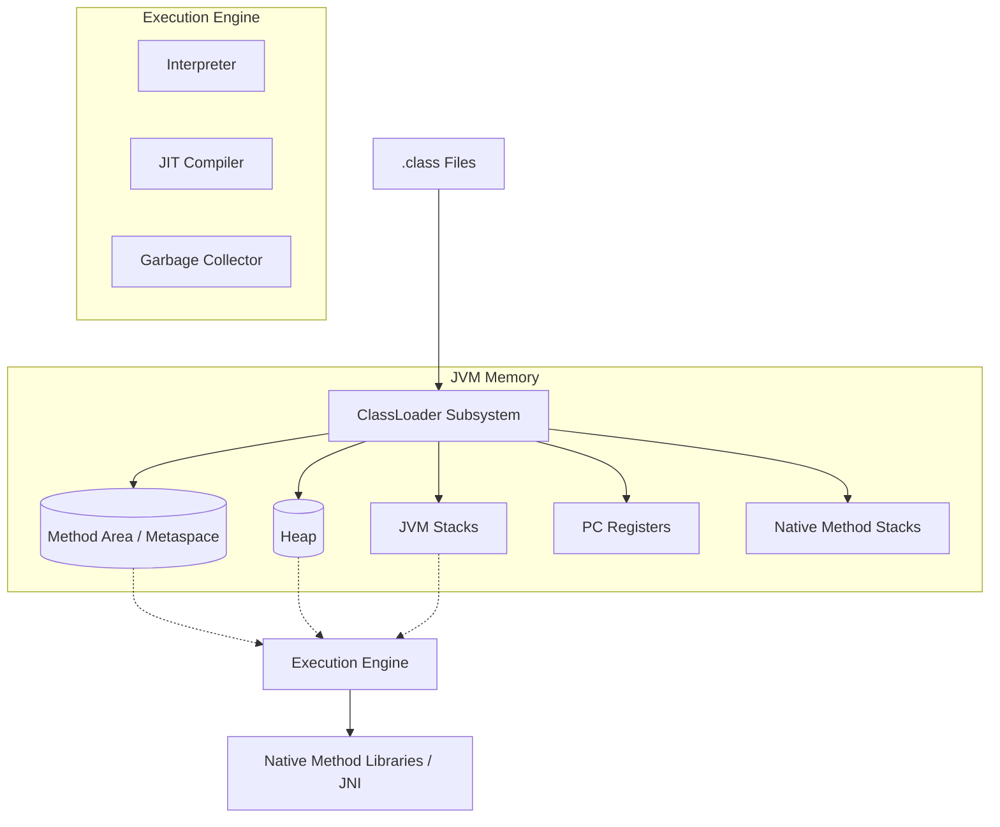
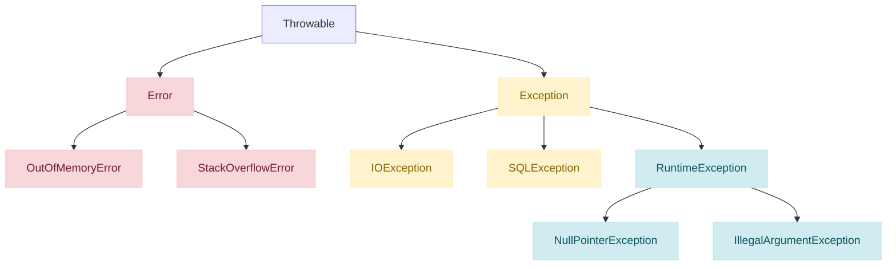
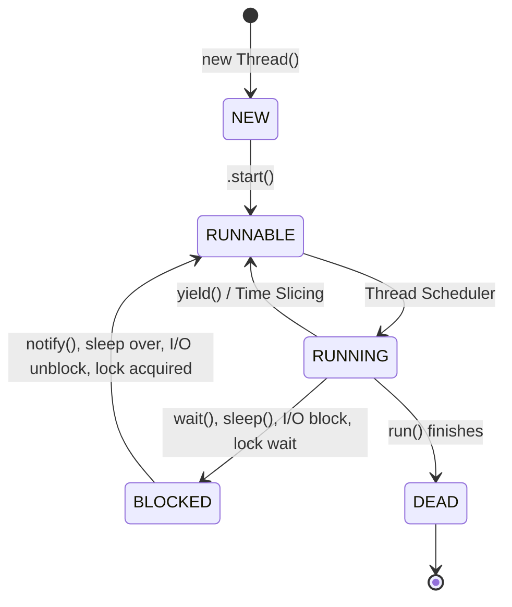
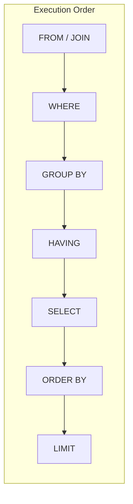
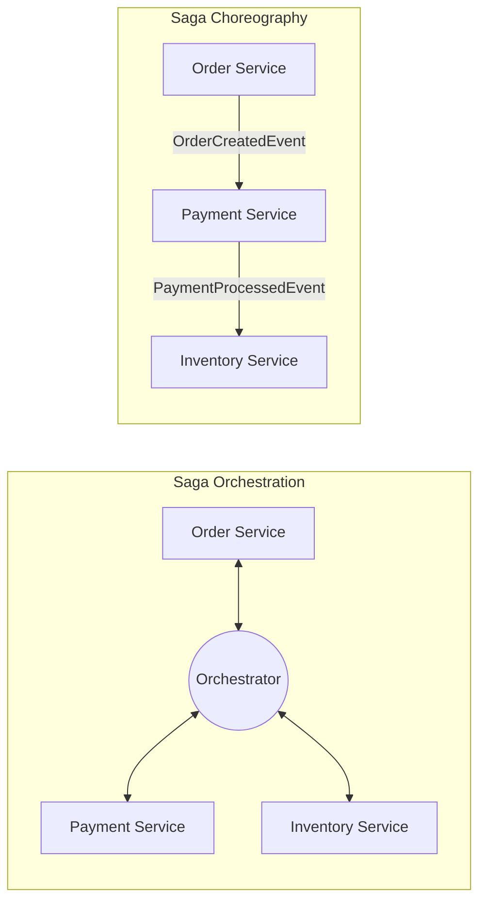
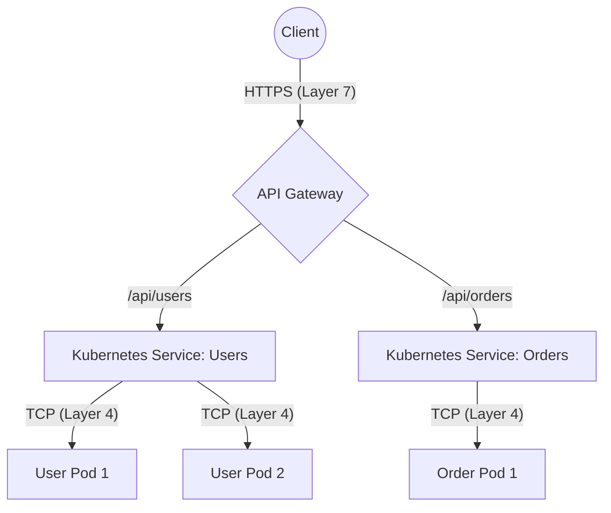

# Comprehensive Java Backend Interview Q&A Master

> **Scope:** A master compilation of interview questions and answers designed for a Senior Java Full-Stack Developer.
> **Philosophy:** Answers follow the "Confident Candidate" style—crisp definitions, deep architectural reasoning, and practical trade-offs.

---

## Part 1: Java / JRE / JVM

### 1. What is Java Virtual Machine (JVM)? Difference between JVM / JDK / JRE?
**The JVM is an abstract computing machine that enables a computer to run a Java program, while JRE provides the runtime environment, and JDK is the full development kit.**
- **JVM (Java Virtual Machine):** The engine that executes Java bytecode. It performs class loading, bytecode verification, and interpretation/JIT compilation. It is platform-dependent (there’s a specific JVM for Windows, Linux, etc.).
- **JRE (Java Runtime Environment):** A package containing the JVM along with standard Java class libraries (rt.jar, etc.) required to *run* Java applications.
- **JDK (Java Development Kit):** The complete toolset containing the JRE plus development tools like `javac` (compiler), `jdb` (debugger), and `javadoc`.

### 2. Explain the JVM architecture and its main components. What are the runtime data areas?
**The JVM architecture consists of three main subsystems: the ClassLoader, Runtime Data Areas, and the Execution Engine.**



- **ClassLoader Subsystem:** Responsible for Loading, Linking (Verification, Preparation, Resolution), and Initialization of class files.
- **Runtime Data Areas:**
  - **Method Area (Metaspace):** Stores class-level data (metadata, static variables, constant pool). Shared among all threads.
  - **Heap:** Stores all instantiated objects and arrays. Shared among all threads and is the primary target for Garbage Collection.
  - **Stack:** Thread-local. Stores local variables, method call frames, and partial results.
  - **PC Register:** Thread-local. Holds the address of the currently executing JVM instruction.
  - **Native Method Stack:** Thread-local. Stores state for native (C/C++) methods invoked via JNI.
- **Execution Engine:** Contains the Interpreter (reads bytecode line-by-line) and the JIT Compiler (compiles hot bytecode into native machine code for performance).

### 3. What are the thread-specific runtime data areas in JVM? Explain their roles.
**The thread-specific areas are the JVM Stack, PC Register, and Native Method Stack. They are isolated per thread, meaning thread creation directly consumes memory in these areas.**
- **JVM Stack:** Every time a thread is created, a JVM stack is allocated. It pushes a "frame" for every method invocation. Too much recursion leads to `StackOverflowError`.
- **Impact of thread creation:** Since each thread gets its own Stack (default usually 1MB on 64-bit systems), creating thousands of blocked threads consumes massive off-heap memory, leading to `OutOfMemoryError: unable to create new native thread`. This is why Virtual Threads (Project Loom) were introduced in Java 21 to map thousands of virtual threads to a few OS threads.

### 4. Explain the Java Memory Model (JMM) and its guarantees.
**The JMM defines the rules for how threads interact through memory, specifically ensuring visibility and ordering of variable modifications across CPU caches.**
- **Visibility:** Without synchronization, a write by Thread A in its L1/L2 cache might not be visible to Thread B. The JMM provides mechanisms (`volatile`, locks) to flush caches to main memory.
- **Ordering:** Compilers and CPUs reorder instructions for optimization. The JMM guarantees that certain operations (like `volatile` reads/writes) act as memory barriers to prevent unsafe reordering.

### 5. What are happens-before relationships in JMM?
**The "happens-before" relationship is a guarantee that memory writes by one specific operation are visible to another specific operation.**
- **Monitor Lock Rule:** An `unlock` on a mutex happens-before every subsequent `lock` on that same mutex.
- **Volatile Variable Rule:** A write to a `volatile` field happens-before every subsequent read of that same field.
- **Thread Start Rule:** A call to `Thread.start()` happens-before any action in the started thread.

### 6. How does the JVM implement volatile variables and atomic operations?
**The JVM implements `volatile` using memory barriers (fences) at the CPU instruction level to prevent reordering and enforce immediate main-memory visibility, while atomic operations rely on hardware-level Compare-And-Swap (CAS) instructions.**
- `volatile` prevents the variable from being cached in CPU registers. However, it does *not* provide atomicity for compound operations (like `i++`).
- `AtomicInteger` (and similar classes) use `Unsafe.compareAndSwapInt()` to implement lock-free, atomic read-modify-write operations directly leveraging CPU architecture (e.g., `LOCK CMPXCHG` on x86).

### 7. Your production service shows frequent Full GCs. How do you analyze and resolve it?
**Frequent Full GCs indicate a severe memory leak, an undersized Old Gen, or excessive object promotion. I would capture a heap dump or use JFR to pinpoint the memory hogs.**
- **Analysis:** 
  1. Check GC logs (`-Xlog:gc*`) to see if Old Gen is filling up and not shrinking after a Full GC (classic memory leak).
  2. Use **JFR (Java Flight Recorder)** to profile allocation rates and thread behavior with negligible overhead.
  3. Trigger a heap dump (`jmap -dump:live`) and analyze it with Eclipse MAT or VisualVM to find the "GC Roots" keeping large object graphs alive.
- **Resolution:** Fix memory leaks (e.g., unclosed resources, unbounded caches), tune heap size (`-Xmx`), or switch/tune the GC algorithm (e.g., G1GC region sizing, ZGC).

### 8. Various JVM or java args that can help fine tune the java and JVM performance?
- **Heap Sizing:** `-Xms4G -Xmx4G` (Setting them equal prevents heap expansion/contraction overhead).
- **GC Selection:** `-XX:+UseG1GC` (Default in 9+), `-XX:+UseZGC` (Low latency).
- **MetaSpace:** `-XX:MaxMetaspaceSize=256m` (Prevents Metaspace from unbounded growth).
- **GC Logging:** `-Xlog:gc*=info:file=gc.log:time,uptime,level,tags:filecount=5,filesize=10M`
- **OOM Dumps:** `-XX:+HeapDumpOnOutOfMemoryError -XX:HeapDumpPath=/dumps/`

### 9. What is MetaSpace? How does it differ from PermGen?
**Metaspace (Java 8+) replaces PermGen to store class metadata; unlike PermGen which lived on the JVM heap, Metaspace allocates out of native OS memory.**
- **PermGen (pre-Java 8):** Had a fixed maximum size. Heavy use of reflection or dynamic class loading (like Spring/Hibernate proxies) frequently caused `OutOfMemoryError: PermGen space`.
- **Metaspace (Java 8+):** Auto-grows using native memory by default. It eliminates PermGen OOMs, though it's best practice to cap it (`-XX:MaxMetaspaceSize`) to prevent OS-level memory exhaustion.

---

## Part 2: Java 8 Features

### 1. What are Functional Interfaces? Why added? Is @FunctionalInterface mandatory?
**A Functional Interface is an interface with exactly one abstract method (SAM). They were introduced to enable lambda expressions and method references in Java.**
- **`@FunctionalInterface`:** It is *not* mandatory, but highly recommended. It acts as a compiler safeguard, throwing an error if someone accidentally adds a second abstract method.

### 2. Difference between Predicate, Function, and Supplier?

| Interface | Method Signature | Input | Output | Common Use Case |
| :--- | :--- | :--- | :--- | :--- |
| **`Predicate<T>`** | `boolean test(T t)` | `T` | `boolean` | Filtering streams (e.g., `filter(x -> x > 10)`) |
| **`Function<T, R>`** | `R apply(T t)` | `T` | `R` | Transforming objects (e.g., `map(User::getName)`) |
| **`Supplier<T>`** | `T get()` | None | `T` | Lazy generation / factories (e.g., `() -> new User()`) |
| **`Consumer<T>`** | `void accept(T t)` | `T` | None (void) | Executing side-effects (e.g., `forEach(System.out::println)`) |

- **`Predicate<T>`:** Takes an argument `T` and returns a `boolean`. Used for filtering.
- **`Function<T, R>`:** Takes an argument `T` and returns a result `R`. Used for mapping/transformation.
- **`Supplier<T>`:** Takes no arguments and returns a result `T`. Used for lazy generation or instantiation.
- **`Consumer<T>`:** Takes an argument `T` and returns nothing (void). Used for side effects.

### 3. Write a FI for summing 2 numbers or FizzBuzz.
```java
@FunctionalInterface
interface MathOperation {
    int operate(int a, int b);
}

// Usage
MathOperation addition = (a, b) -> a + b;
System.out.println(addition.operate(5, 10)); // 15
```

### 4. What is the default method, and why is it required?
**Default methods allow interfaces to have concrete method implementations, introduced primarily to add backward-compatible capabilities to existing interfaces (like `forEach` on `Iterable`) without breaking existing implementations.**

### 5. Can a functional interface extend another interface?
**Yes, as long as the total number of abstract methods across the hierarchy remains exactly one.** If it inherits an abstract method and doesn't declare a new one, it is functional. It can inherit any number of default or static methods.

### 6. Method references? Syntax? Sorting strings ignoring case.
**Method references (`::`) are shorthand syntax for lambdas that simply call an existing method.**
Syntax types: Static (`Math::max`), Bound Instance (`System.out::println`), Unbound Instance (`String::toLowerCase`), Constructor (`ArrayList::new`).
```java
List<String> list = Arrays.asList("Apple", "banana", "Cherry");
// Using lambda
list.sort((s1, s2) -> s1.compareToIgnoreCase(s2));
// Using method reference
list.sort(String::compareToIgnoreCase);
```

### 7. Difference between lambdas and anonymous inner classes in scope and performance?
- **Scope:** Anonymous classes create a new scope (variables inside shadow variables outside; `this` refers to the anonymous class). Lambdas are lexically scoped (`this` refers to the enclosing class).
- **Performance:** Anonymous classes compile into physical `.class` files (e.g., `MyClass$1.class`) adding class-loading overhead. Lambdas use `invokedynamic` at runtime to generate the implementation dynamically, which is faster and consumes less memory.

### 8. Asynchronous Programming? CompletableFuture?
**`CompletableFuture` is an extension of `Future` that allows declarative, non-blocking, asynchronous pipeline chaining without "callback hell."**
It supports methods like `thenApply()` (map), `thenCompose()` (flatMap), and `allOf()` to orchestrate parallel tasks efficiently.

### 9. Diff between terminal and intermediate operations in Java 8?
- **Intermediate:** (e.g., `filter`, `map`, `sorted`) They are *lazy* and return a new Stream. They do not execute until a terminal operation is invoked.
- **Terminal:** (e.g., `collect`, `forEach`, `reduce`) They consume the stream, trigger the execution pipeline, and produce a final result.

### 10. Parallel streams? When to use? Pitfalls in a web application?
**Parallel streams divide the stream workload across multiple threads using the common `ForkJoinPool`.**
- **Pitfalls in Web Apps:** Web servers (like Tomcat) already handle requests concurrently. Using `parallelStream()` inside a request handler steals threads from the common pool, potentially bottlenecking *other* simultaneous HTTP requests and leading to severe latency degradation. Only use for CPU-intensive tasks on massive datasets.

### 11. What is a Spliterator in Java 8? Diff between Iterator vs Spliterator?
**A Spliterator (Splitable Iterator) is designed specifically for parallel execution, capable of partitioning a collection into smaller chunks for concurrent processing.**
- **Iterator:** Sequential, strictly one-by-one traversal.
- **Spliterator:** Can traverse elements one-by-one (`tryAdvance`) but can also split off a chunk of elements (`trySplit`) to be processed by another thread.

### 12. Is multiple inheritance possible in Java 8? Diamond problem?
**Java does not support state-based multiple inheritance (classes), but Java 8 introduced behavior-based multiple inheritance via interface default methods.**
- **Diamond Problem:** If a class implements two interfaces that both have a default method with the identical signature, the compiler throws an error. The class *must* override the method and explicitly choose which interface's method to invoke using `InterfaceName.super.methodName()`.

---

## Part 3: Collections

### 1. Internal working of ArrayList? HashMap? What happens when you put a key object in a HashMap that is already present?
**ArrayList internal working:** It is backed by a dynamic array. When the array is full (reaches capacity), it creates a new array of size `oldCapacity + (oldCapacity >> 1)` (i.e., 50% larger), and copies the old elements using `Arrays.copyOf()`.
**HashMap internal working:** It is backed by an array of Nodes (buckets). The index is calculated via `(n - 1) & hash`. In case of a collision, nodes form a linked list. In Java 8, if a bucket's linked list size exceeds 8 (and total capacity ≥ 64), it converts into a Red-Black Tree for O(log n) lookups.
- **Hashcode and equals:** Used to find the bucket and compare keys. `hashCode()` determines the bucket, `equals()` checks exact match. Immutable classes are best for keys because their hash code won't change after insertion.
- **Replacing existing key:** If you `put()` a key that already exists (where `equals()` returns true), the old value is overwritten by the new value, and `put()` returns the old value.

### 2. Why ConcurrentHashMap when already HashTable present?
**`ConcurrentHashMap` provides highly concurrent lock-free reads and fine-grained locking for writes, avoiding the performance bottleneck of `Hashtable`.**
- **Hashtable:** Synchronizes every method on the object level. If Thread A is reading, Thread B cannot even read.
- **ConcurrentHashMap:** In Java 7, it used **Segmentation** (array of segments, each with its own lock). In Java 8, segments are removed; it uses **CAS (Compare-And-Swap)** for lock-free node insertion and only synchronizes on the specific bucket (the head node) when modifying an existing bucket. Reads are completely lock-free via `volatile` nodes. It never throws `ConcurrentModificationException`.

### 3. What are the differences between a Vector and an ArrayList?

| Feature | `ArrayList` | `Vector` | `LinkedList` |
| :--- | :--- | :--- | :--- |
| **Internal Structure** | Dynamic Array | Dynamic Array | Doubly Linked List |
| **Thread Safety** | No | Yes (Method-level sync) | No |
| **Growth Rate** | 50% of current size | 100% of current size | Node by Node |
| **Random Access** | O(1) | O(1) | O(n) |
| **Best Used For** | Frequent reads, end insertions | Legacy thread-safe code | Frequent insertions/deletions at ends |

**`Vector` is a legacy synchronized collection, whereas `ArrayList` is fast and not thread-safe.**
- **Synchronization:** All methods in `Vector` are synchronized. `ArrayList` methods are not.
- **Growth:** `Vector` doubles its size (100% increase) by default when full. `ArrayList` grows by 50%.
- **Performance:** `ArrayList` is significantly faster due to the absence of locking overhead.

### 4. In which scenario is LinkedList better than ArrayList?
**`LinkedList` is better when the application requires frequent insertions and deletions at the beginning or middle of the list, and random access is not required.**
- **ArrayList:** Shifting elements during an insertion or deletion in the middle is O(n). However, cache locality makes it faster for iteration.
- **LinkedList:** Insertion/deletion (once the node is found) is O(1). However, random access is O(n), and it has high memory overhead for node pointers. In modern Java, `ArrayList` is almost always preferred unless operating as a Queue/Deque.

### 5. What are the differences between a HashMap and a Hashtable?

| Feature | `HashMap` | `Hashtable` (Legacy) | `ConcurrentHashMap` |
| :--- | :--- | :--- | :--- |
| **Thread Safety** | No | Yes (Locks entire map) | Yes (Lock striping / CAS) |
| **Null Key allowed?** | Yes (Only one) | No | No |
| **Null Value allowed?** | Yes | No | No |
| **Performance** | Very Fast | Slow | Fast (Highly concurrent) |
| **Iterator Type** | Fail-fast | Enumerator (Not fail-fast) | Weakly-consistent (Fail-safe) |

**`HashMap` is non-synchronized and permits nulls, whereas `Hashtable` is synchronized and restricts nulls.**
- **Thread Safety:** `Hashtable` is thread-safe; `HashMap` is not.
- **Null Keys/Values:** `HashMap` allows one `null` key and multiple `null` values. `Hashtable` throws `NullPointerException` for any `null` key or value.
- **Performance:** `HashMap` is much faster.

### 6. Internal working of TreeMap? Difference between TreeMap and HashMap?
**`TreeMap` is backed by a Red-Black tree and keeps elements sorted, whereas `HashMap` is backed by a hash table and offers no order guarantees.**
- **Internal Working:** `TreeMap` places nodes in a self-balancing binary search tree. Operations (`put`, `get`, `remove`) take O(log n) time.
- **Ordering:** `HashMap` does not maintain order. `TreeMap` sorts elements by the natural ordering of keys or a provided `Comparator`.
- **Nulls:** `TreeMap` does not allow `null` keys (throws NPE during comparison), while `HashMap` allows one.

### 7. Immutable class? Why needed? How to make them secure from I/O and reflection?
**Immutable classes (like `String`) cannot have their state modified after creation, making them inherently thread-safe and excellent as map keys.**
- **How to create:** Mark class as `final`, fields as `private final`, do not expose setters, initialize via constructor, and perform deep copies for mutable objects in constructors and getters.
- **Security from Reflection/I/O:** Reflection can change `private final` fields. To prevent this, throw an exception in the constructor if the object is already instantiated. For Serialization (I/O), implement the `readResolve()` method to return the existing instance.

### 8. Shallow and Deep cloning? Which is needed for Immutable classes?
**Shallow cloning copies field references, while deep cloning recursively copies the referenced objects.**
- **Shallow Clone:** Modifying a mutable object inside the clone affects the original.
- **Deep Clone:** Completely independent object graph.
- **Immutable Classes:** Deep cloning is **required** in constructors and getters when the immutable class holds references to mutable objects (like `Date` or `List`) to prevent external modifications.

### 9. Comparator vs Comparable? Implement Employee sort descending by salary.
**`Comparable` provides a single natural sorting sequence inside the class, whereas `Comparator` provides multiple external sorting strategies.**
```java
// Comparator for descending salary
Comparator<Employee> byDescSalary = (e1, e2) -> Double.compare(e2.getSalary(), e1.getSalary());

// Using Java 8 syntax:
Comparator<Employee> byDescSalaryModern = Comparator.comparingDouble(Employee::getSalary).reversed();
```

### 10. Collections vs Arrays classes? When to use synchronized collections?
**`Collections` is a utility class for Collection interfaces, while `Arrays` is for native arrays.**
- **Synchronized Collections:** Created via `Collections.synchronizedList()` etc. Use them only for basic thread-safety in legacy code. For high concurrency, use `java.util.concurrent` classes (like `ConcurrentHashMap` or `CopyOnWriteArrayList`) as they perform much better than synchronized wrappers which lock the entire collection.

### 11. What is CopyOnWriteArrayList? How is it different from ArrayList?
**`CopyOnWriteArrayList` is a thread-safe variant where all mutative operations (`add`, `set`, etc.) are implemented by making a fresh copy of the underlying array.**
- **Difference:** Iteration over it does not throw `ConcurrentModificationException` because the iterator works on a snapshot of the array taken when the iterator was created. It is much slower for writes but extremely fast for reads.

### 12. WeakHashMap? WeakReference? SoftReference?
**These references allow the GC to reclaim objects under different conditions.**
- **SoftReference:** Reclaimed only if the JVM is running out of memory. Ideal for caches.
- **WeakReference:** Reclaimed during the very next GC cycle if there are no strong references to it.
- **WeakHashMap:** A map where keys are `WeakReference`s. If the key object has no other strong references, the entry is automatically removed by the GC. Great for storing metadata associated with an object whose lifecycle you don't control.

### 13-15. Sorting Customer objects in an ArrayList by firstName?
**You can use the `List.sort()` method introduced in Java 8 with a method reference.**
```java
List<Customer> list = new ArrayList<>();
// ... add customers ...
list.sort(Comparator.comparing(Customer::getFirstName));
```

### 16. Difference between Synchronized Collection and Concurrent Collection?
**Synchronized collections lock the entire object for every operation, killing scalability. Concurrent collections use lock-striping, CAS, and snapshots to allow true concurrent access.**

### 17. Scenario to use ConcurrentHashMap in Java?
**When you need a thread-safe map that is heavily read by multiple threads and occasionally updated, such as a high-performance application cache, session registry, or a shared configuration map.**

### 18. How will you create an empty Map in Java?
**For an immutable empty map (Java 9+), use `Map.of()`. For legacy code, use `Collections.emptyMap()`. For a mutable empty map, use `new HashMap<>()`.**

### 19. Difference between remove() method of Collection and remove() of Iterator?
**`Collection.remove(Object)` can cause `ConcurrentModificationException` if called while iterating over the collection using a `for-each` loop. `Iterator.remove()` safely removes the current element during iteration without throwing the exception.**

### 20. Between an Array and ArrayList, which one is preferred for storing objects?
**`ArrayList` is overwhelmingly preferred** due to its dynamic resizing, rich API, and seamless integration with the Java Collections Framework and Streams API. Arrays are preferred only for multi-dimensional arrays or performance-critical sections dealing with primitives (to avoid autoboxing overhead).

### 21. Is it possible to replace Hashtable with ConcurrentHashMap?
**Yes, it is highly recommended.** `ConcurrentHashMap` is a drop-in replacement (both implement `ConcurrentMap`) that provides far superior performance while maintaining thread-safety and the same contract of disallowing null keys/values.

### 22. How is CopyOnWriteArrayList different from Vector?
**`Vector` uses a single lock for all operations, blocking readers while a writer is active. `CopyOnWriteArrayList` never blocks readers; writers create a new copy of the array, allowing readers to traverse the old snapshot lock-free.**

### 23. Why does ListIterator have an add() method but Iterator does not?
**`Iterator` is a generic traversal interface for all Collections (Sets, Queues), which don't necessarily have a concept of "current position" for insertion. `ListIterator` is specific to `List`, which is an ordered sequence, making it semantically valid to insert an element at the iterator's current cursor position.**

### 24. Why do we sometimes get ConcurrentModificationException during iteration?
**This occurs in fail-fast collections (like `ArrayList`, `HashMap`) when the collection is structurally modified (added/removed) after the iterator is created, except through the iterator's own `remove()` method. The iterator checks a `modCount` variable and throws CME if it doesn't match its expected value.**

### 25. How will you convert a Map to a List in Java?
**You can convert keys, values, or entries into a list.**
```java
List<KeyType> keys = new ArrayList<>(map.keySet());
List<ValueType> values = new ArrayList<>(map.values());
List<Map.Entry<K, V>> entries = new ArrayList<>(map.entrySet());
```

### 26. How can we create a Map with reverse view and lookup in Java?
**You can use a Bi-directional Map, such as Google Guava's `BiMap` or Apache Commons `BidiMap`.** They allow unique values and provide an `inverse()` method to flip keys and values.

### 27. How will you create a shallow copy of a Map?
**You can pass the map to a new map's constructor or use `putAll()`.**
```java
Map<K, V> shallowCopy = new HashMap<>(originalMap);
```
*(The map structure is new, but the keys and values are the exact same object references).*

### 28. Why can we not create a generic array in Java?
**Because of Type Erasure.** In Java, generic type parameters are erased at compile time (e.g., `List<String>` becomes just `List`). Arrays, however, carry their type information at runtime (reified). If you could create `new T[10]`, the JVM wouldn't know what actual type of array to instantiate in memory.

### 29. What is a PriorityQueue in Java?
**An unbounded queue based on a priority heap.** The elements are ordered according to their natural ordering or a provided `Comparator`. The head of the queue is always the "least" element with respect to the specified ordering. It is not thread-safe (use `PriorityBlockingQueue` for concurrency).

---

## Part 4: Exception Handling

### 1. What is the base class for Error and Exception classes in Java?
**The base class for both is `java.lang.Throwable`.**



- `Error`: Represents serious problems that a reasonable application should not try to catch (e.g., `OutOfMemoryError`, `StackOverflowError`).
- `Exception`: Indicates conditions that a reasonable application might want to catch. It branches into Checked Exceptions and Unchecked Exceptions (`RuntimeException`).

### 2. What is a finally block in Java? Output of following public class FinallyTest...
**A `finally` block is used to execute crucial code such as closing connections, regardless of whether an exception is handled or not.**
If the code is:
```java
public class FinallyTest {
    public static int testMethod() {
        try { return 10; } 
        catch (Exception e) { return 20; } 
        finally { return 30; }
    }
}
```
**Output:** `Result: 30`.
*Why?* The `finally` block always executes. If it contains a `return` statement, it overrides any value returned by the `try` or `catch` block.

### 3. In Java, what are the differences between a Checked and Unchecked? Examples? How would you handle these?
**Checked exceptions are verified at compile-time, while unchecked exceptions occur at runtime.**
- **Checked (`Exception`):** E.g., `IOException`, `SQLException`. The compiler forces you to handle them using `try-catch` or declare them using `throws`. They represent recoverable conditions outside the program's immediate control.
- **Unchecked (`RuntimeException`):** E.g., `NullPointerException`, `IllegalArgumentException`. They represent programming bugs or logical errors. You are not forced to catch them; instead, you should fix the code to prevent them.

### 4. Can we create a finally block without creating a catch block? In what scenarios, a finally block will not be executed?
**Yes, a `try` block can be followed solely by a `finally` block (a `try-finally` structure).**
The `finally` block will **not** execute in the following scenarios:
1. `System.exit()` is called in the `try` or `catch` block.
2. The JVM crashes or the system shuts down forcefully.
3. The thread executing the `try` or `catch` block is killed or interrupted (and throws an exception not handled by the thread).
4. An infinite loop occurs in the `try` block.

### 5. What is the concept of Exception Propagation?Example by code?
**Exception propagation means an exception is thrown from the top of the call stack and drops down the call stack to previous methods until it is caught.** Unchecked exceptions propagate automatically, but checked exceptions must be explicitly declared with `throws` to propagate.
```java
public void method3() {
    int result = 10 / 0; // Throws ArithmeticException
}
public void method2() {
    method3(); // Exception drops down to here
}
public void method1() {
    try {
        method2();
    } catch (ArithmeticException e) {
        System.out.println("Exception caught and handled in method1");
    }
}
```

### 6. When we override a method in a Child class, can we throw an additional Exception that is not thrown by the Parent class method?
**It depends on whether the exception is Checked or Unchecked.**
- **Unchecked Exceptions:** The child method can throw *any* unchecked exception, regardless of the parent's signature.
- **Checked Exceptions:** The child method *cannot* throw a new or broader checked exception. It can only throw the same checked exception, a subclass of it, or no exception at all. This ensures adherence to the Liskov Substitution Principle.

### 7. Try with resource? Any changes done in it recently? When to use?
**`try-with-resources` ensures that any resource implementing `java.lang.AutoCloseable` is automatically closed at the end of the statement.**
- **When to use:** Always use it when dealing with streams, files, or database connections to prevent resource leaks (no need for a messy `finally` block).
- **Recent changes (Java 9):** You can now use effectively final variables declared outside the `try` block. 
```java
// Java 9+ feature
BufferedReader reader = new BufferedReader(new FileReader("file.txt"));
try (reader) { 
    System.out.println(reader.readLine());
} 
// reader is automatically closed here
```

---

## Part 5: String

### 1 & 2. What does Immutable mean in the context of String, and why is it immutable?
**Immutable means once a `String` object is created, its state (the characters it contains) cannot be modified.** Any operation that seems to modify a String (like `.concat()` or `.toUpperCase()`) actually returns a brand-new `String` object.
*Why is it immutable?*
- **Security:** Strings are used for sensitive data like database URLs, usernames, passwords, and file paths. If they were mutable, a malicious thread could change the connection URL after security checks.
- **String Pool:** Immutability is the foundational requirement for the String Pool. If strings were mutable, changing one literal would silently change all other references pointing to the same literal in the pool.
- **Thread Safety:** Being immutable, Strings are inherently thread-safe and can be safely shared among multiple threads without synchronization.
- **Caching Hashcode:** Since the string content never changes, its `hashCode` is cached on the first call, making it extremely fast when used as a key in a `HashMap`.

### 3, 5, 30 & 33. How many objects are created in these scenarios?
**Scenario A:** `String s = new String("Shiv"); String s1 = "Shiv"; String s2 = "Shiv";`
- **Objects created:** 2. 
- *Why?* `new String("Shiv")` creates one object in the Heap. The literal `"Shiv"` creates one object in the String Pool. `s1` and `s2` simply point to the same existing pool object.

**Scenario B:** `String s1 = "abc"; String s2 = new String("abc"); String s3 = s2.toUpperCase();`
- **Objects created:** 3 (or 4 depending on JVM optimization, but typically 3).
- *Why?* `"abc"` goes to the String Pool (1). `new String("abc")` creates a new object in the Heap (2). `toUpperCase()` returns `"ABC"` which is a new object in the Heap (3).

### 4. How many ways are there to create a String object?
**There are two primary ways:**
1. **String Literal:** `String s = "Java";` (Stored in the String Pool).
2. **`new` Keyword:** `String s = new String("Java");` (Forces the creation of a new object in the Heap memory).

### 6, 7 & 31. What is String interning and the String literal concept? What is the output?
**String interning is a method of storing only one copy of each distinct String value, which must be immutable.** The String Pool (in Metaspace/Heap depending on Java version) caches these literals to save memory.
```java
String s1 = "Java";
String s2 = "Java";
String s3 = new String("Java");
String s4 = s3.intern();

System.out.println(s1 == s2); // true (Both point to the same pool object)
System.out.println(s1 == s3); // false (s3 is a separate object in the Heap)
System.out.println(s1 == s4); // true (intern() returns the reference from the pool)
```
*Why use literals?* It aggressively optimizes memory consumption and speeds up comparisons (reference equality `==` is faster than `equals()`).

### 8 & 11. String vs StringBuffer vs StringBuilder? Order of efficiency?
**Efficiency Order (Fastest to Slowest): `StringBuilder` > `StringBuffer` > `String`**

| Feature | `String` | `StringBuffer` | `StringBuilder` |
| :--- | :--- | :--- | :--- |
| **Mutability** | Immutable | Mutable | Mutable |
| **Thread Safety** | Yes (Inherently) | Yes (Synchronized) | No |
| **Performance** | Slowest | Moderate | Fastest |
| **Storage** | String Pool / Heap | Heap | Heap |

- **`String`:** Immutable. Every modification creates a new object. Worst performance for heavy string concatenations.
- **`StringBuffer`:** Mutable and **thread-safe** (synchronized methods). Much faster than `String` for modifications, but the synchronization overhead makes it slower than `StringBuilder`.
- **`StringBuilder`:** Mutable and **not thread-safe**. Fastest option for string manipulation in a single-threaded environment.

### 9. How will you create an immutable class in Java?
**By preventing subclassing and ensuring all fields are `private final`.**
1. Declare the class as `final`.
2. Make all fields `private` and `final`.
3. Do not provide setter methods.
4. If a field is a mutable object (like `Date` or `List`), perform a **deep copy** in the constructor and return a **cloned copy** in the getter.

### 10. What is the use of `toString()` method in Java?
**It returns a string representation of the object.** By default, `Object.toString()` returns `ClassName@HashCodeHex`. It should always be overridden in domain/model classes to return a human-readable representation of the object's state, which is crucial for debugging and logging.

### 32. Output of the following string concatenation?
```java
String s = "Hello";
s.concat("World");
System.out.println(s);
```
**Output:** `Hello`
*Why?* Strings are immutable. `s.concat("World")` creates a new String object `"HelloWorld"`, but since we didn't assign it back to `s` (e.g., `s = s.concat("World");`), the original string reference `s` remains unchanged. The new object is lost and eligible for Garbage Collection.

---

## Part 6: Multithreading

### 1 & 17. Thread vs Runnable vs Callable? How to create threads?
**Threads can be created by extending `Thread`, implementing `Runnable`, or implementing `Callable`.**



- **Runnable vs Thread:** Implementing `Runnable` is better because Java doesn't support multiple inheritance (you can implement `Runnable` and extend another class). It also cleanly separates the task (Runnable) from the runner (Thread).
- **Runnable vs Callable:** `Runnable` has a `void run()` method and cannot return a result or throw checked exceptions. `Callable` has a `V call()` method which can return a result (wrapped in a `Future`) and throw checked exceptions.
- **Lambda:** Since `Runnable` is a functional interface, you can create a thread via lambda: `new Thread(() -> System.out.println("Running")).start();`

### 2 - 11. The `synchronized` keyword, Locks, and JVM implementation
**`synchronized` guarantees mutual exclusion and visibility, preventing race conditions.**
- **Block vs Method:** Synchronized blocks are preferred over synchronized methods because they allow locking on a specific object and limit the locked scope, reducing thread contention.
- **Instance vs Static:** Synchronized instance methods lock on the current instance (`this`). Synchronized static methods lock on the Class object (`ClassName.class`).
- **Two different synchronized methods:** If Thread A calls `syncMethod1()` and Thread B calls `syncMethod2()` on the *same* object, Thread B will block until A finishes, because both methods use the same intrinsic lock (`this`).
- **Can constructors be synchronized?** No, because object creation is inherently thread-safe (the object is not visible to other threads until the constructor completes).
- **JVM Internals:** The JVM uses `monitorenter` and `monitorexit` bytecode instructions. It employs optimizations like **biased locking** (assuming one thread will re-acquire the lock) and **lightweight locking** (CAS operations) before escalating to an expensive OS-level heavy lock.

### 12, 16 & 19. wait(), notify(), notifyAll() vs sleep()
**`wait()`, `notify()`, and `notifyAll()` are defined in `Object`, not `Thread`, because they operate on object monitors (locks).**
- **wait():** MUST be called from a synchronized context. When called, the thread immediately **releases the lock** and goes into a waiting state until notified.
- **sleep():** Defined in `Thread`. It pauses execution but **does NOT release the lock**.
- **notify vs notifyAll:** `notify()` wakes up one random waiting thread; `notifyAll()` wakes up all waiting threads (though they must still compete for the lock).

### 13 & 14. Java Memory Model (JMM), Race Conditions, and Volatile
**A Race Condition is a synchronization problem (simultaneous writes); a Visibility Problem is a memory caching problem (one thread doesn't see another's write).**
- **JMM & Happens-Before:** The JMM defines how threads interact through memory. The "happens-before" guarantee ensures that memory writes by one specific statement are visible to another specific statement.
- **`volatile`:** It solves the visibility problem by forcing reads/writes to go directly to main memory instead of CPU caches. However, it does *not* solve race conditions for compound operations like `count++`.

### 15 & 23. Daemon Threads and ThreadLocal
- **Daemon Thread:** A background thread (like the Garbage Collector) that does not prevent the JVM from exiting when all user threads finish. You *cannot* change a thread to daemon after it has started (it throws `IllegalThreadStateException`).
- **ThreadLocal:** Provides thread-local variables. Each thread accessing the `ThreadLocal` has its own independently initialized copy of the variable. Used for per-thread context (e.g., Database connections, user sessions, transaction IDs) without passing parameters everywhere.

### 18. ExecutorService and Thread Pools
**`ExecutorService` manages thread creation, pooling, and task scheduling.**
- **Types:** `FixedThreadPool` (fixed size), `CachedThreadPool` (unbounded, reuses threads), `ScheduledThreadPool` (for delayed/periodic tasks), `SingleThreadExecutor` (guarantees sequential execution).
- **Considerations:** Always avoid unbounded queues or `CachedThreadPool` under heavy load as they can lead to `OutOfMemoryError`. Properly size the pool based on workload: CPU-bound (Threads ≈ CPU Cores) vs I/O-bound (Threads > CPU Cores).

### 20 - 22. ReentrantLock vs Intrinsic Locks (synchronized)
**`ReentrantLock` (from `java.util.concurrent.locks`) offers advanced features that `synchronized` lacks.**
- **Advanced Features:** Explicit `lock()` and `unlock()`, fairness policies (longest waiting thread gets the lock first), ability to interrupt a waiting thread (`lockInterruptibly()`), and ability to poll for a lock (`tryLock()`).
- **Reentrant:** Both `synchronized` and `ReentrantLock` are reentrant, meaning a thread holding the lock can re-acquire it without deadlocking itself.
- **ReentrantReadWriteLock:** Provides a pair of locks. Multiple threads can hold the read lock concurrently (if no writers), but the write lock is exclusive. Great for read-heavy data structures.

### 24. How to ensure Threads T1 and T2 run in sequence?
**You can use the `Thread.join()` method.** 
```java
T1.start();
T1.join(); // The current thread waits here until T1 finishes
T2.start();
```

### 25. Difference between CyclicBarrier and CountDownLatch?
**Both are synchronization aids, but they have different reset semantics.**
- **CountDownLatch:** Maintains a count. Threads call `await()` and block until the count reaches zero (other threads call `countDown()`). Once zero, it *cannot* be reused.
- **CyclicBarrier:** A synchronization point where threads wait for each other (`await()`). When all expected threads reach the barrier, it trips, they all proceed, and the barrier is *reset* for reuse.

---

## Part 7: Miscellaneous

### 1. Serializable vs Externalizable? Significance of `serialVersionUID`?
**Both interfaces are used for object serialization, but they differ in control.**
- **`Serializable`:** A marker interface. Serialization is handled automatically by the JVM. It uses reflection and is slower.
- **`Externalizable`:** Extends `Serializable` and provides two methods (`writeExternal` and `readExternal`). It gives the developer complete control over the serialization process, making it much faster as it avoids reflection.
- **`serialVersionUID`:** It acts as a version control ID for a Serializable class. During deserialization, the JVM compares the ID of the incoming byte stream with the local class. If they don't match, an `InvalidClassException` is thrown. Always declare it explicitly to prevent issues when the class structure changes.

### 2. What are Marker interfaces? Why are they required?
**Marker interfaces (like `Serializable`, `Cloneable`, `Remote`) have no methods or fields.**
- **Why required:** They provide metadata to the JVM or framework about a class. For example, if a class implements `Cloneable`, the JVM's `Object.clone()` method knows it is legally allowed to perform field-by-field copying.
- *Modern Alternative:* In modern Java, annotations (e.g., `@Entity`, `@Override`) are overwhelmingly preferred over marker interfaces for metadata, as they are more flexible and don't affect the class hierarchy.

### 3. Is there any difference between `a = a + b` and `a += b`?
**Yes, `a += b` includes an implicit typecast.**
If you have:
```java
short a = 1;
short b = 2;
a = a + b; // Compiler Error! (a + b) results in an int.
a += b;    // Compiles fine! It internally does: a = (short)(a + b);
```

### 4. Overriding a method throwing `NullPointerException` with `RuntimeException`?
**Yes, you can do this.**
Because both `NullPointerException` and `RuntimeException` are **Unchecked Exceptions**, the compiler does not enforce the exception overriding rules. A subclass method can throw any unchecked exception, regardless of what the parent method throws.

### 5. Can we make an array `volatile`? Any caveats? How to do it properly?
**Yes, you can declare an array reference as `volatile`, but there is a major caveat.**
- **The Caveat:** Making an array `volatile` only ensures the visibility of the *array reference itself*. It does **not** guarantee visibility for the individual *elements* inside the array. If Thread A modifies `array[0]`, Thread B is not guaranteed to see the change.
- **Proper Solution:** To make the elements volatile, you must use `java.util.concurrent.atomic.AtomicIntegerArray` or `AtomicReferenceArray`. These provide lock-free, thread-safe, and visible operations on individual array indices.

### 6. Which class contains the `clone()` method? Is `Cloneable` broken?
**The `clone()` method is defined in the `java.lang.Object` class (as `protected`), NOT in the `Cloneable` interface.**
- **Is `Cloneable` broken?** Yes, it is widely considered a broken interface by Java experts (including Joshua Bloch). It contains no methods, yet it magically changes the behavior of `Object.clone()`. It forces shallow copying by default, fails with `final` fields, and requires painful exception handling (`CloneNotSupportedException`).
- **Better Alternative:** Provide a **Copy Constructor** (e.g., `public Employee(Employee original)`) or a static factory method to clone objects instead.

### 7. What will `5 * 0.1 == 0.5` return?
**It returns `true`.**
*However*, if the question was `3 * 0.1 == 0.3`, it returns **`false`**!
- **Why?** Floating-point arithmetic (IEEE 754) cannot represent 0.1 perfectly in binary. While 0.5 is exactly representable (1/2), numbers like 0.3 are not. `3 * 0.1` actually evaluates to something like `0.30000000000000004`. 
- **Rule:** Never use `==` to compare floating-point numbers. Use `BigDecimal` for precise calculations (especially for currency).

---

## Part 8: Spring/Spring Boot

### 1. IOC and DI? Purpose and benefits of the IOC container in Spring?
**Inversion of Control (IoC)** is a design principle where the control of object creation and lifecycle is transferred from the application code to a framework (the IoC container). **Dependency Injection (DI)** is the pattern used to implement IoC, where the container injects the required dependencies into an object.
- **Benefits:** Loose coupling, high testability (easy to mock dependencies), and modularity.
- **DI Types:** Constructor Injection (Preferred for mandatory dependencies) and Setter Injection (For optional dependencies). Field injection is generally discouraged due to poor testability.

### 2. Spring Singleton vs Java Singleton? Is a Spring Singleton thread-safe?
**They are fundamentally different in scope.**
- **Java Singleton (GoF):** Guarantees exactly one instance of a class per ClassLoader (JVM level).
- **Spring Singleton:** Guarantees exactly one instance of a bean per Spring IoC Container (`ApplicationContext`).
- **Thread Safety:** A Spring Singleton bean is **NOT** inherently thread-safe. If the bean maintains state (mutable instance variables), concurrent requests will lead to race conditions. Spring singletons should ideally be stateless (e.g., Services, Repositories).

### 3. Lifecycle of a Spring Bean?
**The lifecycle follows a strict sequence managed by the IoC Container:**

```mermaid
flowchart TD
    Start((Start)) --> Instantiate[1. Instantiation (Constructor)]
    Instantiate --> Populate[2. Populate Properties (DI)]
    Populate --> Aware[3. Aware Interfaces (BeanNameAware, etc.)]
    Aware --> PreInit[4. BeanPostProcessor (Before Init)]
    PreInit --> Init[5. Initialization (@PostConstruct, afterPropertiesSet)]
    Init --> PostInit[6. BeanPostProcessor (After Init / Proxies)]
    PostInit --> Ready[(7. Bean is Ready for Use)]
    Ready --> Destroy[8. Destruction (@PreDestroy, destroy-method)]
    Destroy --> End((End))
```

1. **Instantiation:** The container creates the bean instance (via reflection).
2. **Populate Properties:** DI is performed (dependencies are injected).
3. **`BeanNameAware` / `BeanFactoryAware`:** Injects the bean's name/factory if interfaces are implemented.
4. **`BeanPostProcessor.postProcessBeforeInitialization()`:** Custom logic before initialization.
5. **`@PostConstruct` / `InitializingBean.afterPropertiesSet()` / `init-method`:** Custom initialization logic.
6. **`BeanPostProcessor.postProcessAfterInitialization()`:** Custom logic (often used for AOP proxy generation).
7. **Bean is Ready:** Bean is handed over to the application.
8. **Destruction:** On shutdown, `@PreDestroy` / `DisposableBean.destroy()` / `destroy-method` are called.

### 4. Autowiring conflicts? `@Primary`, `@Qualifier`, and Convention over Configuration?
**If two beans implement the same interface, Spring doesn't know which one to inject and throws a `NoUniqueBeanDefinitionException`.**
- **Convention over Configuration:** Spring will attempt to match the name of the reference variable to a bean name. If a bean is named `creditCardPayment` and the variable is `Payment creditCardPayment`, it works.
- **`@Primary`:** Indicates the default bean to inject when multiple candidates are present.
- **`@Qualifier("beanName")`:** Explicitly tells Spring the exact name of the bean to inject, overriding `@Primary`.

### 5. `@Configuration` and `@Bean`?
**Used for Java-based configuration (replacing XML).**
- **`@Configuration`:** Marks a class as a source of bean definitions. Spring uses CGLIB to proxy this class, ensuring that calls to `@Bean` methods return the same singleton instance rather than creating new objects.
- **`@Bean`:** Placed on a method within a `@Configuration` class. It tells Spring that this method will return an object that should be registered as a bean in the application context.

### 6. `@Autowired` vs `@Inject`?
- **`@Autowired`:** Spring's proprietary annotation for dependency injection.
- **`@Inject`:** The Java standard (JSR-330, Contexts and Dependency Injection) equivalent. 
- *Verdict:* They function identically in a Spring environment. Use `@Inject` if you want your code to be completely decoupled from the Spring Framework API, otherwise `@Autowired` is standard practice.

### 7 & 8. `@Controller` vs `@RestController`? `@ResponseBody` vs `ResponseEntity`?

| Annotation | Composition | Primary Use Case | Return Value Resolution |
| :--- | :--- | :--- | :--- |
| **`@Controller`** | Standalone | Traditional MVC web apps | Resolves to a View (HTML/JSP/Thymeleaf) |
| **`@RestController`** | `@Controller` + `@ResponseBody` | RESTful Web APIs | Serialized to JSON/XML in Response Body |

**`@RestController` is simply a convenience annotation that combines `@Controller` and `@ResponseBody`.**
- **`@Controller`:** Used for traditional Spring MVC where methods return a View name (JSP/Thymeleaf).
- **`@ResponseBody`:** Tells Spring to serialize the return object directly into the HTTP response body (usually as JSON) rather than resolving it to a View. This is why it's not explicitly needed in `@RestController`.
- **`ResponseEntity<T>`:** Gives you full control over the HTTP response. Unlike a plain return object (which defaults to HTTP 200 OK), `ResponseEntity` allows you to specify custom HTTP status codes (e.g., 201 Created, 404 Not Found) and custom headers alongside the body.

### 9. Significance of `@SpringBootApplication`?
**It is the entry point annotation for a Spring Boot app, combining three powerful annotations:**
1. **`@SpringBootConfiguration`:** Acts identically to `@Configuration`, marking the class as a configuration source.
2. **`@EnableAutoConfiguration`:** Tells Spring Boot to start adding beans based on classpath settings, other beans, and various property settings.
3. **`@ComponentScan`:** Scans the package (and sub-packages) where the application class is located for Spring components (`@Service`, `@Controller`, etc.).

### 10. How does `@ComponentScan` work if no package name is given?
**By default, it scans the current package where the class containing the `@ComponentScan` annotation resides, as well as all its sub-packages.** This is why the main application class is usually placed in the root package.

### 11. How does `@EnableAutoConfiguration` enable plug-and-play functionality?
**It leverages the `spring.factories` (or `AutoConfiguration.imports` in newer versions) file.** 
Spring Boot looks for AutoConfiguration classes in external jars. These classes use `@Conditional` annotations (e.g., `@ConditionalOnClass`, `@ConditionalOnMissingBean`) to intelligently evaluate the environment. For example, if it sees `Tomcat` on the classpath, it automatically configures an Embedded Tomcat Web Server without any manual XML/Java configuration from the developer.

---

## Part 9: Spring Controller and Web Layer

### 1 & 7. Handling JSON/XML and Jackson Auto-configuration?
**Spring Boot handles JSON and XML automatically via `HttpMessageConverters`.**
- **JSON:** Spring Boot auto-configures the `Jackson` library (specifically `MappingJackson2HttpMessageConverter`) because `spring-boot-starter-web` includes `jackson-databind`. It automatically serializes/deserializes objects to/from JSON.
- **XML:** To support XML, you must add the `jackson-dataformat-xml` dependency. Then, you can use the `Accept: application/xml` header in the request to get an XML response.

### 2. `@RequestParam` vs `@PathVariable` vs `@RequestBody`?
- **`@RequestParam`:** Extracts query parameters (`?id=123`).
  - *Endpoint:* `/api/users?id=123`
  - *Method:* `public User getUser(@RequestParam String id)`
- **`@PathVariable`:** Extracts values from the URI path.
  - *Endpoint:* `/api/users/123`
  - *Method:* `public User getUser(@PathVariable String id)`
- **`@RequestBody`:** Deserializes the incoming HTTP request body (JSON/XML) into a Java object.
  - *Endpoint:* `POST /api/users` with JSON body
  - *Method:* `public User createUser(@RequestBody User user)`

### 3 & 4. REST API Best Practices and Idempotency?
**Best Practices for URI Naming:**
- Use nouns, not verbs (e.g., `/users` instead of `/getUsers`).
- Use plural nouns (e.g., `/users/123`).
- Use sub-resources for relations (e.g., `/users/123/orders`).

**HTTP Methods & Idempotency:**
An operation is **idempotent** if making multiple identical requests has the same effect as making a single request.
- **GET, PUT, DELETE, OPTIONS, HEAD:** Idempotent. (Deleting a resource twice results in it still being deleted; updating it twice with the same data results in the same state).
- **POST, PATCH:** **Non-idempotent.** (POST creates a new resource every time).

### 5 & 26. Implementing and Validating File Uploads/Downloads?
**File Upload:** Use `MultipartFile` in the controller.
```java
@PostMapping("/upload")
public String upload(@RequestParam("file") MultipartFile file) {
    // Validate file.isEmpty(), file.getSize(), file.getContentType()
    // Save bytes using file.transferTo()
}
```
**File Download:** Return a `ResponseEntity<Resource>` or `byte[]` with the `Content-Disposition: attachment` header.

### 6. Configuring CORS in Spring Boot?
**Cross-Origin Resource Sharing (CORS)** can be configured in two ways:
1. **Method/Controller Level:** Using the `@CrossOrigin` annotation on specific endpoints.
2. **Global Level:** By implementing `WebMvcConfigurer` and overriding the `addCorsMappings` method to define rules for all paths (`/**`).

### 8, 18 & 19. DispatcherServlet Lifecycle and Request Flow?
**The `DispatcherServlet` is the Front Controller in Spring MVC.**
1. **Client Request:** Hits the `DispatcherServlet`.
2. **Handler Mapping:** `DispatcherServlet` consults `HandlerMapping` to find the appropriate Controller method based on the URL.
3. **Interceptors (PreHandle):** `HandlerInterceptor.preHandle()` methods are executed.
4. **Controller:** The actual controller method executes and returns data.
5. **Interceptors (PostHandle):** `HandlerInterceptor.postHandle()` executes.
6. **Message Conversion/View Resolution:** If `@ResponseBody` is used, the `HttpMessageConverter` writes JSON directly to the response. Otherwise, the `ViewResolver` renders the HTML page.

### 9. Richardson Maturity Model and HATEOAS?
**The Richardson Maturity Model grades REST APIs:**
- Level 0: One URI, one HTTP method (RPC style).
- Level 1: Multiple URIs (Resources).
- Level 2: Uses standard HTTP methods (GET, POST, etc.) and Status Codes.
- Level 3: **HATEOAS (Hypermedia As The Engine Of Application State).**

**HATEOAS:** The API response includes hypermedia links (URLs) to dynamically guide the client on what actions are possible next (e.g., a "self" link, an "update" link). In Spring Boot, this is implemented using `spring-boot-starter-hateoas` and the `EntityModel`/`WebMvcLinkBuilder` classes.

### 12 - 16. Caching in Spring Boot (`@Cacheable`, `@CachePut`, `@CacheEvict`)?
**Spring Boot provides abstraction over caching providers (Redis, Ehcache) via `@EnableCaching`.**
- **`@Cacheable`:** Checks if the result is in the cache. If yes, returns it. If no, executes the method and caches the result. 
  - *Internal working:* Uses AOP (CacheInterceptor). It intercepts the method call, looks up the cache via `CacheManager`, and makes a presence decision.
  - *Conditions:* `@Cacheable(condition="#id > 10", unless="#result == null")`.
- **`@CachePut`:** *Always* executes the method and updates the cache with the new result. (Used for updates).
- **`@CacheEvict`:** Removes data from the cache. (Used for deletes).

### 14 & 17. Clustered Caching, Cache Stampede, and Multi-level Caching?
- **Clustered Environment:** You cannot use in-memory caches (ConcurrentHashMap). You must use a distributed cache like **Redis** or Memcached so all instances share the same state.
- **Cache Stampede (Avalanche):** Occurs when a highly popular cache key expires, and thousands of concurrent requests hit the database simultaneously to rebuild it. *Prevention:* Add jitter/randomness to TTLs, or use a distributed lock (Mutex) so only one thread rebuilds the cache while others wait.
- **Multi-level Caching:** L1 (In-memory Caffeine) + L2 (Redis). Fast reads from L1, fallback to L2, fallback to DB. *Disadvantage:* High complexity in maintaining cache invalidation synchronization across all L1 nodes.

### 20 - 25. Data Validation (`@Valid` vs `@Validated`, Custom Validation)?
**Spring Boot uses Hibernate Validator (JSR-380).**
- **`@Valid`:** Standard Java validation. Validates the object payload.
- **`@Validated`:** Spring's variant. It allows **Validation Groups** (e.g., validating differently for Create vs Update) and is required at the class level to validate `@PathVariable` and `@RequestParam`.
- **Nested Objects & Collections:** To validate a nested object or a `List<Object>` inside a payload, you must place `@Valid` on the nested field/collection inside the DTO.
- **Custom Annotations:** Created by defining an `@interface` annotated with `@Constraint(validatedBy = MyValidator.class)` and writing a class implementing `ConstraintValidator`.
- **Cross-Field Validation:** E.g., `password == confirmPassword`. Implemented via a Custom Annotation placed at the **Class level** rather than the field level, so the validator has access to the entire object.

---

## Part 10: Spring Exception Handling

### 1 & 3. Exception Handling via `@ControllerAdvice` and `@ExceptionHandler`? Global Handling?
**Spring allows you to decouple exception handling from your business logic using Global Exception Handlers.**
- **`@ControllerAdvice`:** A specialized `@Component` that allows you to consolidate your multiple, scattered `@ExceptionHandler` methods from all controllers into a single, global error handling component.
- **`@ExceptionHandler`:** An annotation placed on a method to indicate that this method should handle a specific type of Exception (e.g., `@ExceptionHandler(ResourceNotFoundException.class)`).
- **GlobalExceptionHandler Signature:**
```java
@ControllerAdvice
public class GlobalExceptionHandler {
    // Handles specific custom exceptions
    @ExceptionHandler(ResourceNotFoundException.class)
    public ResponseEntity<ErrorResponse> handleNotFound(ResourceNotFoundException ex) {
        return new ResponseEntity<>(new ErrorResponse(404, ex.getMessage()), HttpStatus.NOT_FOUND);
    }
    
    // Fallback for unhandled exceptions globally
    @ExceptionHandler(Exception.class)
    public ResponseEntity<ErrorResponse> handleGlobalException(Exception ex) {
        return new ResponseEntity<>(new ErrorResponse(500, "Internal Server Error"), HttpStatus.INTERNAL_SERVER_ERROR);
    }
}
```

### 2. `@ControllerAdvice` vs `@RestControllerAdvice`?
**It is the exact same relationship as `@Controller` vs `@RestController`.**
- **`@ControllerAdvice`:** Methods must explicitly use `@ResponseBody` if you want them to return JSON instead of resolving to a View.
- **`@RestControllerAdvice`:** A convenience annotation combining `@ControllerAdvice` and `@ResponseBody`. It automatically serializes the return object into the HTTP response body (JSON/XML).

### 4. `@ControllerAdvice` vs `HandlerExceptionResolver`?
- **`HandlerExceptionResolver`:** The core interface Spring uses to resolve exceptions. It gives you raw access to the `HttpServletRequest`, `HttpServletResponse`, and the exception. It is lower-level and harder to use when you just want to return a JSON payload.
- **`@ControllerAdvice`:** Built *on top of* the `HandlerExceptionResolver` infrastructure (specifically `ExceptionHandlerExceptionResolver`). It is the modern, declarative, and preferred approach for REST APIs as it seamlessly integrates with `ResponseEntity` and `@ResponseBody`.

### 5. `@ExceptionHandler` vs `@ResponseStatus`?
- **`@ExceptionHandler`:** Gives you **full control**. You execute a method when an exception occurs, allowing you to log the error, construct a rich custom JSON response body, and dynamically determine the HTTP status code.
- **`@ResponseStatus`:** Gives you **no control over the body**. It can be placed directly on a custom Exception class (e.g., `@ResponseStatus(HttpStatus.NOT_FOUND) public class MyException...`). When the exception is thrown, Spring simply returns the specified HTTP status code with the default Spring Boot error page/JSON, without executing any custom method logic.

### 6. Best Practices: Throwing Runtime Exceptions vs Custom Exceptions?
**It is a BEST practice to throw Custom Runtime Exceptions (Unchecked) in Spring.**
- **Why Unchecked (`RuntimeException`)?** Checked exceptions clutter the codebase with `try-catch` blocks and `throws` declarations, breaking encapsulation (the caller shouldn't care about a DB-level checked exception). Spring inherently favors Unchecked exceptions (e.g., `DataAccessException`).
- **Structuring Custom Exceptions:**
  1. Create a base abstract runtime exception for your domain.
  2. Create specific exceptions extending it (`UserNotFoundException`, `InvalidPaymentException`).
  3. Let the Service layer throw these custom exceptions when business invariants fail.
  4. Let the `@RestControllerAdvice` catch them at the boundary and translate them into standardized HTTP Responses (JSON) with proper HTTP Status codes.

---

## Part 11: Spring Data JPA & Transactions

### 1. Diff bw JDBC and Hibernate/JPA?
- **JDBC (Java Database Connectivity):** The low-level standard API for interacting with databases. It is extremely fast but requires writing lots of boilerplate code (opening/closing connections, handling `ResultSet` mapping, manual SQL queries) and is tightly coupled to the specific database dialect.
- **JPA (Java Persistence API):** A specification for ORM (Object-Relational Mapping). **Hibernate** is the most popular implementation of JPA.
- **Why ORM?** It maps Java objects (Entities) directly to database tables, completely eliminating boilerplate code. It provides caching (L1/L2), dirty checking, and database independence (switching from MySQL to PostgreSQL requires zero code changes, just dialect configuration).

### 2. What are the common annotations used in Spring Data JPA for entity mapping? (@Entity, @Table, @Id, @GeneratedValue, @Column)
- **`@Entity`:** Marks the class as a JPA entity.
- **`@Table(name="users")`:** Specifies the exact table name (if different from the class name).
- **`@Id`:** Marks the primary key field.
- **`@GeneratedValue(strategy = GenerationType.IDENTITY)`:** Configures how the primary key is auto-incremented by the database.
- **`@Column(name="email", nullable=false, unique=true)`:** Maps a field to a specific column and defines constraints.

### 3. Explain the difference between CrudRepository, PagingAndSortingRepository, and JpaRepository. Which one should you prefer?
- **`CrudRepository`:** Provides basic CRUD (Create, Read, Update, Delete) operations. Returns `Iterable`.
- **`PagingAndSortingRepository`:** Extends `CrudRepository` and adds methods to support pagination (`Pageable`) and sorting (`Sort`).
- **`JpaRepository`:** Extends `PagingAndSortingRepository`. It is the most powerful. It returns `List` instead of `Iterable`, and provides JPA-specific features like `flush()`, `saveAndFlush()`, and batch deletes in a block. **Prefer `JpaRepository`** for standard Spring Boot applications.

### 4. How do you implement custom queries in Spring Data JPA? JPQL vs Native?
**You define custom queries using the `@Query` annotation on repository interface methods.**
- **JPQL (Java Persistence Query Language):** Queries the *Entity Objects*, not the database tables. It is database-agnostic.
  ```java
  @Query("SELECT u FROM User u WHERE u.email = ?1")
  User findByEmailAddress(String email);
  ```
- **Native SQL:** Queries the underlying database tables directly. Used when you need to leverage database-specific functions.
  ```java
  @Query(value = "SELECT * FROM users u WHERE u.email = ?1", nativeQuery = true)
  User findByEmailNative(String email);
  ```

### 5. Transaction propagation behaviours? REQUIRED vs REQUIRES_NEW
**Configured via `@Transactional(propagation = Propagation.XXX)`.**
- **`REQUIRED` (Default):** If there is already an active transaction, the method joins it. If there is no transaction, it creates a new one. (e.g., if Method A calls Method B, they both share the exact same transaction. If B fails, A rolls back).
- **`REQUIRES_NEW`:** The method *always* starts a completely new transaction. If an existing transaction exists, it is suspended until the new one completes. (e.g., Logging an audit trail in the DB. Even if the main transaction rolls back, the audit log transaction commits successfully).

### 6. Isolation levels? (READ_UNCOMMITTED, READ_COMMITTED, REPEATABLE_READ, SERIALIZABLE)

| Isolation Level | Dirty Read | Non-Repeatable Read | Phantom Read | Concurrency Speed |
| :--- | :--- | :--- | :--- | :--- |
| **`READ_UNCOMMITTED`** | Allowed | Allowed | Allowed | Very Fast (Unsafe) |
| **`READ_COMMITTED`** | **Prevented** | Allowed | Allowed | Fast |
| **`REPEATABLE_READ`** | **Prevented** | **Prevented** | Allowed | Moderate |
| **`SERIALIZABLE`** | **Prevented** | **Prevented** | **Prevented** | Slow (Sequential) |

**Configured via `@Transactional(isolation = Isolation.XXX)`. It solves concurrency anomalies (Dirty Reads, Non-Repeatable Reads, Phantom Reads).**
1. **`READ_UNCOMMITTED`:** Lowest level. Allows Dirty Reads (reading uncommitted changes from other transactions).
2. **`READ_COMMITTED`:** (PostgreSQL/Oracle default). Prevents Dirty Reads. Only committed data is read.
3. **`REPEATABLE_READ`:** (MySQL default). Prevents Dirty and Non-Repeatable Reads. If you read a row twice in one transaction, it will be the same, even if another transaction updated and committed it in the meantime.
4. **`SERIALIZABLE`:** Highest level. Prevents all anomalies including Phantom Reads by essentially executing transactions sequentially. Very slow; rarely used.

### 7. What is N+1 problem in Hibernate? How do you resolve it in Spring Data JPA using @EntityGraph or JOIN FETCH?
**The N+1 problem occurs when you fetch a list of entities (1 query) and then accidentally trigger an additional query for each entity to fetch its lazy-loaded associations (N queries).**
- *Example:* Fetching 50 Authors, then calling `author.getBooks()` in a loop. It executes 1 query for authors, and 50 queries for books (51 total queries).
- **Solution 1 - `JOIN FETCH`:** In a custom `@Query`, use `SELECT a FROM Author a JOIN FETCH a.books`. This forces Hibernate to fetch everything in a single SQL query using an inner/outer join.
- **Solution 2 - `@EntityGraph`:** Used above the repository method to dynamically specify which lazy associations should be fetched eagerly for that specific query.

### 8. Explain the difference between fetch = FetchType.LAZY and fetch = FetchType.EAGER. Which is the default for associations?

| FetchType | Behavior | Default For | Performance Impact | Use Case |
| :--- | :--- | :--- | :--- | :--- |
| **`LAZY`** | Delays loading until getter is called | `@OneToMany`, `@ManyToMany` | **High** (Prevents unnecessary data loading) | Preferred for almost all associations |
| **`EAGER`** | Loads immediately via SQL JOIN | `@OneToOne`, `@ManyToOne` | **Low** (Can cause N+1 and memory bloat) | Rarely used; prefer `JOIN FETCH` instead |

- **`LAZY`:** The associated entity is not loaded from the database until you explicitly call its getter method (a Proxy object is returned initially). Best for performance.
- **`EAGER`:** The associated entity is loaded immediately along with the parent entity using a JOIN. Can lead to serious memory and performance issues if the graph is huge.
- **Defaults:**
  - `*ToOne` (`@OneToOne`, `@ManyToOne`) defaults to **`EAGER`**.
  - `*ToMany` (`@OneToMany`, `@ManyToMany`) defaults to **`LAZY`**.
  - *Best Practice:* Explicitly set everything to `LAZY` and use `JOIN FETCH` when you need the data.

### 9. Pagination and sorting in Spring Data JPA?
**Achieved by passing a `Pageable` or `Sort` object to the repository method.**
```java
Pageable pageable = PageRequest.of(pageNumber, pageSize, Sort.by("email").descending());
Page<User> page = userRepository.findAll(pageable);
```

### 10. How do you use @Query annotation for custom JPQL queries?
**You use it on a repository method to write a JPQL query.** JPQL operates on Entities rather than tables.
```java
@Query("SELECT u FROM User u WHERE u.email = ?1")
User findByEmailAddress(String email);
```

### 11. How do you enable pagination and sorting in Spring Data JPA?
**By making your repository extend `PagingAndSortingRepository` or `JpaRepository`, and passing a `Pageable` object as an argument.** Spring Data automatically appends the `LIMIT`/`OFFSET` clauses based on the database dialect.

### 12. What is the role of EntityManager in Spring Data JPA?
**`EntityManager` is the core JPA interface used to interact with the Persistence Context.** Spring Data JPA heavily abstracts this away, but under the hood, all repository methods delegate to `EntityManager` (e.g., `persist()`, `merge()`, `remove()`).

### 13. When to use @OneToOne, @OneToMany, @ManyToOne, @ManytoMany?
- **`@OneToOne`:** A user has one Profile.
- **`@OneToMany`:** A User has many Orders. (Usually the non-owning side).
- **`@ManyToOne`:** Many Orders belong to one User. (Usually the owning side holding the foreign key).
- **`@ManyToMany`:** Students and Courses. (Requires a join table).

### 14. Explain the difference between fetch = FetchType.LAZY and FetchType.EAGER.
- **`LAZY`:** The associated entity is not loaded from the DB until its getter is explicitly called (a proxy is returned). Excellent for performance.
- **`EAGER`:** The associated entity is loaded immediately using a SQL JOIN. Can lead to major performance bottlenecks.

### 15. N+1 query problem? caused by FetchType.EAGER or lazy loading?
**It is caused by `LAZY` loading when iterating over a collection.** If you load N entities (1 query) and then call a getter on a lazy collection inside a loop, it triggers N additional queries. (It can also happen with EAGER if you use JPQL without a `JOIN FETCH`).

### 16. How do you use @Query annotation for custom JPQL queries? Let’s say we want to modify data in Table using @Query what other annotations required?
**To modify data using `@Query` (UPDATE or DELETE), you must add `@Modifying` and `@Transactional`.**
```java
@Modifying
@Transactional
@Query("UPDATE User u SET u.active = false WHERE u.lastLoginDate < ?1")
int deactivateOldUsers(LocalDate date);
```

### 17. Use of @modifying and @Transactional?
- **`@Modifying`:** Tells Spring Data that the `@Query` is not a SELECT query, but rather a DML operation (UPDATE/DELETE).
- **`@Transactional`:** Ensures the method runs within a database transaction, which is strictly required for executing DML statements.

### 18. How do you implement auditing in Spring Data JPA (@CreatedDate, @LastModifiedDate)?
1. Add `@EnableJpaAuditing` on a configuration class.
2. Add `@EntityListeners(AuditingEntityListener.class)` to your entity.
3. Annotate fields with `@CreatedDate`, `@LastModifiedDate`, `@CreatedBy`, or `@LastModifiedBy`.

### 19. How do you handle optimistic and pessimistic locking in Spring Data JPA?
- **Optimistic Locking:** Adds a version number to the entity. No DB locks are held. If two threads update concurrently, one gets an `ObjectOptimisticLockingFailureException`.
- **Pessimistic Locking:** Uses database-level locks (e.g., `SELECT ... FOR UPDATE`). Prevents other transactions from even reading/writing the locked rows until the transaction ends.

### 20. @version? @Lock? @Transactional?various lock modes?
- **`@Version`:** Placed on an integer field to enable Optimistic locking automatically.
- **`@Lock`:** Placed on repository methods. Modes include `PESSIMISTIC_READ` (shared lock), `PESSIMISTIC_WRITE` (exclusive lock), and `OPTIMISTIC` (forces a version check).
- **`@Transactional`:** Defines the transaction boundaries for the locking mechanisms to operate within.

### 21. How do you integrate Spring Data JPA with multiple data sources?
You must manually configure two sets of:
1. `DataSource` beans (e.g., `@Primary` for DB1, secondary for DB2).
2. `LocalContainerEntityManagerFactoryBean` (to point to different entity packages).
3. `PlatformTransactionManager`.
Then use `@EnableJpaRepositories` to map the repository packages to their respective `EntityManagerFactory`.

### 22. How do you implement multi-tenancy with Spring Data JPA?application connects or holds data for multiple orgs or clients….How to handle this in Spring Boot app? DB per tenant, Schema per tenant, shared schema discriminator based
- **DB per tenant:** Highest isolation. Use an `AbstractRoutingDataSource` to dynamically switch the database URL based on the tenant context (e.g., from a JWT).
- **Schema per tenant:** Use Hibernate's `CurrentTenantIdentifierResolver` and `MultiTenantConnectionProvider` to switch schemas on the fly.
- **Shared Schema (Discriminator):** All tenants share tables. Every table has a `tenant_id` column. Enforce it using Hibernate Filters (`@FilterDef`) to automatically append `WHERE tenant_id = ?` to every query.

### 23. How does Spring Data JPA work with native queries and projections?
- **Native Queries:** Set `nativeQuery = true` inside `@Query` to use raw SQL.
- **Projections:** Used to fetch only specific columns. You define a Java Interface with getters (e.g., `String getFirstName();`), and the repository method returns `List<UserProjection>`.

### 24. How do you debug and optimize slow queries in Spring Data JPA?
- **Debug:** Enable `spring.jpa.show-sql=true` and `spring.jpa.properties.hibernate.format_sql=true`. Use `p6spy` or `datasource-proxy` to see parameter values instead of `?`.
- **Optimize:** Add database indexes, use `JOIN FETCH` to eliminate N+1, use Projections to fetch fewer columns, and configure proper batch sizes.

### 25. How do you handle bidirectional relationships and avoid infinite recursion in JSON serialization?
Use Jackson annotations:
- Place `@JsonManagedReference` on the parent side (it gets serialized).
- Place `@JsonBackReference` on the child side (it gets ignored during serialization).
*Alternatively:* Use `@JsonIgnore` on the child reference, or use DTOs instead of serializing Entities directly.

### 26. How do you implement cascade operations in JPA?
Use the `cascade` attribute on the relationship annotation (e.g., `@OneToMany(cascade = CascadeType.ALL)`). This propagates state transitions (PERSIST, MERGE, REMOVE) from the parent entity down to the child entities automatically.

### 27. How do you use Entity Graphs for optimizing queries?
**Entity Graphs allow you to dynamically override LAZY fetching to EAGER for a specific query.**
Apply `@EntityGraph(attributePaths = {"books", "address"})` on a repository method. It forces Hibernate to fetch those specific relationships in a single `JOIN` query, effectively solving the N+1 problem without writing JPQL.

### 28. How do you implement batch inserts/updates efficiently?
Set the property `spring.jpa.properties.hibernate.jdbc.batch_size=50` (or similar).
*Crucial Limitation:* Hibernate disables JDBC batching if your entity uses `GenerationType.IDENTITY`. You **must** use `GenerationType.SEQUENCE` or `TABLE` for batch inserts to work.

### 29. How do you define a Named Query using @NamedQuery annotation? What is the difference between @NamedQuery and @NamedNativeQuery?
**Defined at the top of the Entity class.**
- **`@NamedQuery`:** Written in database-agnostic JPQL.
- **`@NamedNativeQuery`:** Written in raw, database-specific SQL.

### 30. How does Spring Data JPA resolve Named Queries internally?
By default, Spring Data looks for a Named Query named `<EntityName>.<methodName>`.
If you define `@NamedQuery(name = "User.findByStatus", query = "...")` and have a method `findByStatus(String status)` in `UserRepository`, Spring automatically binds them together.

### 31. What is the precedence between Named Queries and @Query annotation in Spring Data JPA? How do you override a Named Query defined in an entity?
**Precedence:** `@Query` annotation on the repository method > Named Query > Method Name Derivation.
To override a Named Query, simply declare an `@Query` annotation on the repository method; Spring will prioritize it.

### 32. How do you define an index in JPA using annotations?
You use the `@Index` annotation inside the `@Table` annotation on your Entity class:
```java
@Table(name = "users", indexes = {
    @Index(name = "idx_email", columnList = "email")
})
```

### 33. What is the difference between @Index and unique=true on @Column?
- **`unique=true`:** Defines a database Constraint enforcing that no two rows can have the same value. (Most databases implicitly create an index to enforce this).
- **`@Index`:** Explicitly creates a non-unique index to speed up search/read performance on that column.

### 34. Advantage and disadvantages of indexing? What is the impact of indexing on insert/update performance?
- **Advantages:** Dramatically speeds up data retrieval (`SELECT`, `WHERE`, `JOIN`).
- **Disadvantages:** Slower `INSERT`, `UPDATE`, and `DELETE` operations because the database must update the B-Tree index structure every time the data changes. Indexes also consume additional disk space.

### 35. Indexes in joins? Does JPA automatically create indexes for foreign keys?
**No, JPA/Hibernate does NOT automatically create indexes for foreign keys.**
Foreign keys enforce referential integrity but do not automatically provide fast lookups. To optimize `JOIN` operations, you should explicitly define an `@Index` on your foreign key columns using the `@Table` annotation.

---

## Part 12: Database & SQL

### 1. DDl,DML? Diff between Delete and truncate? WHERE vs HAVING?

| Feature | DDL (Data Definition) | DML (Data Manipulation) |
| :--- | :--- | :--- |
| **Purpose** | Define/modify database schema | Manipulate data within tables |
| **Commands** | `CREATE`, `ALTER`, `DROP`, `TRUNCATE` | `INSERT`, `UPDATE`, `DELETE` |
| **Auto-Commit** | Yes (Cannot usually be rolled back) | No (Can be rolled back via Transaction) |

| Feature | `DELETE` | `TRUNCATE` |
| :--- | :--- | :--- |
| **Type** | DML | DDL |
| **Condition (`WHERE`)**| Yes, can delete specific rows | No, wipes the entire table |
| **Performance** | Slow (Logs each row deletion) | Very Fast (Deallocates data pages) |
| **Rollback** | Yes | No (In most databases) |
| **Identity Reset** | No | Yes (Resets auto-increment counters) |

- **DDL vs DML:** DDL (Data Definition Language) commands define schema structure (`CREATE`, `ALTER`, `DROP`). DML (Data Manipulation Language) commands manipulate data (`INSERT`, `UPDATE`, `DELETE`).
- **DELETE vs TRUNCATE:** `DELETE` is DML; it deletes row by row, logs each deletion, and can be rolled back. It supports the `WHERE` clause. `TRUNCATE` is DDL; it deallocates data pages instantly, resets identity columns, cannot be rolled back in most DBs, and is much faster.
- **WHERE vs HAVING:** `WHERE` filters rows *before* aggregation (GROUP BY). `HAVING` filters aggregated data *after* the `GROUP BY` clause has been applied.



### 2. Explain INNER JOIN vs LEFT JOIN with examples.
- **INNER JOIN:** Returns only the records that have matching values in both tables.
  *Example:* `SELECT e.name, d.name FROM Employee e INNER JOIN Department d ON e.dept_id = d.id;` (Returns only employees assigned to a valid department).
- **LEFT JOIN:** Returns all records from the left table, and the matched records from the right table. If there is no match, NULLs are returned for the right table columns.
  *Example:* `SELECT e.name, d.name FROM Employee e LEFT JOIN Department d ON e.dept_id = d.id;` (Returns all employees, even those not assigned to a department).

### 3. ACID properties?
- **Atomicity:** "All or nothing." The transaction completes entirely, or rolls back entirely if any part fails.
- **Consistency:** The database must remain in a consistent state before and after the transaction (all constraints, triggers, and cascades are satisfied).
- **Isolation:** Concurrent transactions execute independently without interfering with each other (preventing dirty reads, etc.).
- **Durability:** Once a transaction is committed, it remains permanently in the database, surviving system crashes.

### 4. Indexing? When to do? Advantage /Disadvantages
- **What is it:** A B-Tree or Hash data structure that improves the speed of data retrieval operations.
- **When to do:** Index columns heavily used in `WHERE`, `JOIN`, `ORDER BY`, or `GROUP BY` clauses.
- **Advantages:** Dramatically speeds up `SELECT` queries.
- **Disadvantages:** Consumes disk space. Significantly slows down `INSERT`, `UPDATE`, and `DELETE` operations because the index tree must be updated on every write.

### 5. How do you implement pagination in SQL?
By using the `LIMIT` and `OFFSET` clauses.
```sql
SELECT * FROM Employee ORDER BY id LIMIT 10 OFFSET 20; 
-- Fetches 10 records starting from the 21st record (Page 3).
```

### 6. Views over tables? Why use views?View vs Materialized Views? Ad/Disad?
- **Views:** Virtual tables based on the result-set of an SQL statement.
- **Why use:** Security (hiding columns), simplifying complex joins for users, and abstracting legacy table structures.
- **View vs Materialized View:** A standard View runs its underlying query every time it is accessed. A Materialized View actually executes the query and caches the results physically on disk. 
- **Adv/Disad of Materialized View:** Super fast for read-heavy complex aggregations, but data becomes stale. It requires manual or scheduled refreshes.

### 7. Arrange in orderof execution WHERE,GROUP BY,SELECT ,HAVING,FROM,JOIN ,ORDER BY ,LIMIT / OFFSET
**Correct Execution Order:**
1. `FROM`
2. `JOIN`
3. `WHERE`
4. `GROUP BY`
5. `HAVING`
6. `SELECT`
7. `ORDER BY`
8. `LIMIT / OFFSET`

### 8. Self join? Why it is required?
**A Self Join is a regular join but the table is joined with itself.**
It is required when comparing rows within the same table or navigating hierarchical data stored in a single table (e.g., finding the Manager's name for an Employee, where both are in the `Employee` table).

### 9. Find name of Employee having second or n max salary. Emplouyee[id, name,salary,dept]
Using `DENSE_RANK()` (SQL Standard for Nth max):
```sql
SELECT name FROM (
    SELECT name, DENSE_RANK() OVER (ORDER BY salary DESC) as rnk 
    FROM Employee
) sub WHERE rnk = 2; -- Change 2 to N
```

### 10. find employees who earn more than the average salary of their department, and rank them within their department by salary.
```sql
WITH DeptAvg AS (
    SELECT dept, AVG(salary) as avg_sal FROM Employee GROUP BY dept
)
SELECT e.name, e.salary, e.dept, 
       RANK() OVER(PARTITION BY e.dept ORDER BY e.salary DESC) as dept_rank
FROM Employee e
JOIN DeptAvg d ON e.dept = d.dept
WHERE e.salary > d.avg_sal;
```

### 11. Find the top 3 highest-paid employees in each department.
```sql
SELECT name, dept, salary FROM (
    SELECT name, dept, salary, 
           DENSE_RANK() OVER(PARTITION BY dept ORDER BY salary DESC) as rnk
    FROM Employee
) sub WHERE rnk <= 3;
```

### 12. Given Employee( id INT, name VARCHAR(50), department_id INT, manager_id INT, salary DECIMAL, hire_date DATE )
*(This is the schema context for the following questions).*

### 13. Find employees who earn more than the average salary of their department.
```sql
SELECT e1.name FROM Employee e1
WHERE e1.salary > (
    SELECT AVG(salary) FROM Employee e2 WHERE e1.department_id = e2.department_id
);
```

### 14. Find employees who joined before the earliest hire date in their department.
*(Logically, an employee cannot join before the earliest hire date of their own department. Assuming the query seeks the employee(s) who hold that earliest hire date):*
```sql
SELECT e1.name FROM Employee e1
WHERE e1.hire_date = (
    SELECT MIN(hire_date) FROM Employee e2 WHERE e1.department_id = e2.department_id
);
```

### 15. Find employees who earn more than the average salary of their department AND more than their manager.
```sql
SELECT e.name FROM Employee e
JOIN Employee m ON e.manager_id = m.id
WHERE e.salary > m.salary 
  AND e.salary > (SELECT AVG(salary) FROM Employee e2 WHERE e.department_id = e2.department_id);
```

### 16. Find employees who have the same salary as someone in another department.
```sql
SELECT e1.name, e1.salary, e1.department_id 
FROM Employee e1
WHERE EXISTS (
    SELECT 1 FROM Employee e2 
    WHERE e1.salary = e2.salary AND e1.department_id != e2.department_id
);
```

### 17. Partitioning?Different types of partitioning? (Range, List, Hash)
- **Partitioning:** Dividing a large table into smaller, more manageable physical pieces while keeping it logically as one table.
- **Range:** Partitions based on a range of values (e.g., `date` column; one partition per year).
- **List:** Partitions based on discrete, exact values (e.g., `country` column; partition for 'US', partition for 'UK').
- **Hash:** Distributes rows based on a hashing algorithm applied to a column. Best for evenly distributing data across disks.

### 18. What is the difference between horizontal partitioning and vertical partitioning?
- **Horizontal Partitioning (Sharding/Table Partitioning):** Divides the table by rows. (e.g., Row 1-1M on Server A, 1M-2M on Server B). The schema remains identical.
- **Vertical Partitioning:** Divides the table by columns. (e.g., heavily accessed `id`, `name` in Table A, rarely accessed `bio`, `profile_picture_blob` in Table B).

### 19. How do you manage indexes on partitioned tables?
- **Local Indexes:** An index created locally on each individual partition. (Preferred for easy partition dropping/adding).
- **Global Indexes:** A single, massive index that spans across all partitions. (Harder to maintain, as dropping a partition invalidates the whole global index).

### 20. What is sub-partitioning and when would you use it?
**Sub-partitioning (Composite Partitioning):** Partitioning a table, and then partitioning those partitions further using a second strategy. 
*Example use case:* You partition data by `Range` (Year/Month), and then sub-partition by `Hash` (Customer ID) to distribute massive monthly data evenly across multiple disks.

### 21. How do you implement partitioning with composite keys?
You define the partition strategy using multiple columns. 
*Example (Range Partitioning by Year and Month):* `PARTITION BY RANGE (year_col, month_col)`. The database evaluates the first key; if there's a tie, it evaluates the second key to determine the target partition.

### 22. Composite keys?Primary keys? Candidate Keys? Surrogate Keys? Is it possible to have a table without a primary key in a relational database? If yes, what are the implications for data integrity and query performance? How would you uniquely identify rows in such a table?
- **Primary Key (PK):** Uniquely identifies each row. Cannot be NULL.
- **Composite Key:** A PK made up of multiple columns (e.g., `order_id` + `product_id`).
- **Candidate Key:** Any column (or set of columns) that *could* qualify as a PK.
- **Surrogate Key:** An artificial key (like an auto-increment integer or UUID) added to act as the PK when natural keys are complex.
- **Can a table exist without a PK?** Yes. But it is terrible practice. 
- **Implications:** 
  1. Data Integrity: Duplicate rows are allowed, making accurate updates/deletions impossible without affecting unintended rows. 
  2. Performance: Querying specific rows requires full table scans. Clustered indexes cannot be created automatically.
- **How to identify rows?** Databases assign hidden internal row IDs (e.g., `CTID` in PostgreSQL or `ROWID` in Oracle) which can be used to query or delete specific duplicate rows.

---

## Part 13: Microservices

### 1. Microservices in your own words? How is it diff from Monolith?benefits of using MS and Downsides?
- **Microservices:** An architectural style that structures an application as a collection of small, autonomous services modeled around a business domain.
- **Diff from Monolith:** A Monolith runs entirely in a single process and is deployed as a single artifact (e.g., one WAR file). Microservices run as independent processes deployed separately.
- **Benefits:** Independent scalability, polyglot persistence/programming, fault isolation, and faster deployment cycles for smaller teams.
- **Downsides:** Extreme operational complexity (distributed tracing, deployment, monitoring), network latency, complex distributed transactions, and data consistency issues.

### 2. How do microservices communicate with each other? Synchronous and Asynchronous modes? REST/HTTPS, SOAP, gRPC, Message queues like RabbitMQ,KafKa etc.
- **Synchronous (Blocking):** The caller waits for the response. 
  - *REST/HTTP:* Easy to implement, highly interoperable, uses JSON.
  - *gRPC:* Built on HTTP/2, uses Protocol Buffers. Extremely fast, strictly typed, excellent for internal service-to-service communication.
- **Asynchronous (Non-blocking):** The caller fires a message and moves on.
  - *Message Queues/Brokers (RabbitMQ, Kafka):* Highly decoupled. The producer sends an event to a topic, and one or multiple consumers react to it. Great for scaling and resilience.

### 3. Explain Event Driven Architecture? How,Why and when used? 
- **What:** An architecture where state changes are broadcasted as "Events" rather than direct API calls.
- **How:** A service publishes an event (e.g., `OrderPlaced`) to a broker (Kafka). Other services subscribe to this event and react (e.g., `InventoryService` reduces stock).
- **Why/When:** Used to achieve massive decoupling, real-time asynchronous processing, and high resilience. If the `InventoryService` is down, the order is still accepted, and inventory will update once the service recovers.

### 4. Explain the difference between an event, a command, and a query in EDA.
- **Command:** A request to do something (e.g., `CreateOrderCommand`). It expects an action and can be rejected.
- **Event:** A statement of fact that something *has already happened* (e.g., `OrderCreatedEvent`). It cannot be rejected or changed.
- **Query:** A request for information without changing the system's state (e.g., `GetOrderDetails`).

### 5. What is the role of an Event Bus or Message Broker in EDA?
It acts as the central nervous system. It receives events from Producers and guarantees their delivery to all subscribed Consumers. It decouples services so they don't need to know each other's network addresses (Service Discovery is handled implicitly by the broker).

### 6. Explain the concept of Event Sourcing and how it differs from traditional CRUD.
- **Traditional CRUD:** Stores the *current state* of an entity in a database table. Previous states are lost unless explicitly logged.
- **Event Sourcing:** Stores every *state-changing event* as an immutable append-only log. The current state is derived by replaying all the events from the beginning. (e.g., Bank account balance is calculated by summing all `MoneyDeposited` and `MoneyWithdrawn` events).

### 7. What are the challenges of implementing distributed transactions in EDA and how do you solve them? Using Saga pattern how can we solve these problems?
- **Challenge:** In a microservices architecture, a single business workflow often spans multiple databases (Database per Service pattern). You cannot use standard ACID transactions (like 2-Phase Commit) because they lock resources across the network, destroying performance and availability.
- **Solution:** The **Saga Pattern**. It breaks the global transaction into a sequence of local ACID transactions.

### 8. Saga pattern?Different types? When how and why use? What happens if one step in a Saga fails?How does it ensure eventual consistency?



- **What:** A sequence of local transactions. If one local transaction fails, the Saga executes a series of **Compensating Transactions** to undo the previous steps.
- **Types:** 
  1. **Choreography:** Services publish and subscribe to events without a central controller (Decentralized, good for simple workflows).
  2. **Orchestration:** A central "Orchestrator" service commands other services to execute transactions (Centralized, better for complex workflows).
- **Eventual Consistency:** Sagas don't use locks. Data might be temporarily inconsistent during the Saga's execution, but once the Saga completes (or fully compensates), the system becomes eventually consistent.

### 9. How do you implement compensating transactions in a Saga? How do you handle retries and idempotency in Saga steps?
- **Compensating Transactions:** For every action (e.g., `ReserveInventory`), you must write code for a reverse action (e.g., `ReleaseInventory`). The Orchestrator calls the reverse action if a subsequent step fails.
- **Idempotency & Retries:** Network calls can fail or timeout. The Orchestrator will automatically *retry* the step. Therefore, every consumer *must* be idempotent (using a unique `eventId` or `transactionId` stored in a DB table to ignore duplicate requests).

### 10. What are the challenges of implementing Saga in a system with high throughput?How about when need to design a Saga for a globally distributed system with strict latency requirements?
- **Throughput Challenges:** High volume generates massive amounts of events and DB writes (saving state/compensating actions). Message brokers (like Kafka) must be heavily partitioned.
- **Latency Challenges:** Sagas are inherently asynchronous and slow. For strict latency, you must avoid Sagas synchronously blocking a user interface. You return an HTTP 202 (Accepted) immediately, run the Saga in the background, and push the final state to the UI via WebSockets or polling.

### 11. CQRS?Differentiate Command and Query ? benefits? Disads? How do you keep the read model in sync with the write model?
- **CQRS (Command Query Responsibility Segregation):** Separates the data model used for updating data (Commands) from the data model used for reading data (Queries).
- **Benefits:** Extreme read performance (read models can be flat, NoSQL tables), independent scaling of read vs write workloads.
- **Disadvantages:** High architectural complexity, requires eventual consistency.
- **Syncing:** The Command service publishes an event (e.g., `UserUpdated`) to a message broker. The Query service consumes this event and updates its own separate Read database.

### 12. Explain how eventual consistency works in CQRS.
Because syncing happens asynchronously via a message broker, there is a delay (milliseconds to seconds) between when a Command writes to the DB and when the Query DB is updated. During this window, reads will return stale data. This is eventual consistency.

### 13. How to implement feign client in an application? What are various steps? Where do you manage URls?How do you handle fallbacks?
- **Steps:** Add `@EnableFeignClients` on the main class. Create an interface annotated with `@FeignClient(name = "inventory-service")`. Define method signatures with Spring MVC annotations (`@GetMapping`).
- **URLs:** Managed dynamically via a Service Registry (like Eureka). The `name` in `@FeignClient` acts as the logical service identifier.
- **Fallbacks:** Handled by configuring Resilience4j (or previously Hystrix). You provide a `fallback` class implementing the Feign interface to return default/cached data if the target service is down.

### 14. difference between fault tolerance and resilience.
- **Fault Tolerance:** The ability of a system to continue operating *without interruption* when a component fails (e.g., redundant hardware, clustered databases).
- **Resilience:** The ability of a system to *gracefully degrade and recover* from a failure. It acknowledges failure will happen and focuses on minimizing impact (e.g., returning cached data instead of an error page).

### 15. How to ensure resilience in MS?What are various resilience patterns? Circuit Breaker? Bulkhead?
- **Circuit Breaker:** Prevents a service from repeatedly trying to call a failing downstream service. It "trips" (opens) after a threshold of failures, failing fast immediately, giving the downstream service time to recover.
- **Bulkhead:** Limits the number of concurrent calls to a downstream service (like compartments in a ship). If one downstream service is slow, it won't consume all the caller's threads, protecting other API routes.
- **Other patterns:** Timeout, Retry, Rate Limiting.

### 16. Load balancing? client-side and server-side load balancing in microservices? Explain any load balancing scheme used in any of your project?
- **Server-Side:** The client hits a central Load Balancer (like Nginx/AWS ALB) which routes traffic to the instances.
- **Client-Side:** The client (or API Gateway) queries a Service Registry (Eureka) to get all IPs of a service, and uses an algorithm (like Round Robin) to pick an instance directly.
- **Scheme Example:** Round-robin (distributes evenly) or Least Connections (sends traffic to the instance with the fewest active requests).

### 17. How does Kubernetes Service load balancing differ from an API Gateway load balancer?



- **Kubernetes Service:** Operates at Layer 4 (TCP/UDP). Uses `kube-proxy` to route internal cluster traffic between pods using virtual IPs.
- **API Gateway:** Operates at Layer 7 (HTTP). It handles external ingress traffic, SSL termination, JWT validation, rate limiting, and sophisticated routing (based on headers/paths) before forwarding to K8s services.

### 18. What is the difference between Layer 4 and Layer 7 load balancing? Which one is better for microservices?
- **Layer 4 (Transport):** Routes traffic based on IP address and Port only. Extremely fast, but dumb.
- **Layer 7 (Application):** Routes traffic based on HTTP content (URL path, Headers, Cookies). 
- **Better for Microservices:** Layer 7 is generally required because microservices rely on path-based routing (e.g., `/api/users` vs `/api/orders`), header propagation, and authentication.

### 19. Steps to implement a Circuit breaker library [Resilience4j or Hysterix]? various states handling?
- **Implementation:** Add `resilience4j-spring-boot2` dependency. Annotate the method with `@CircuitBreaker(name="myService", fallbackMethod="fallbackLogic")`.
- **States:**
  - *CLOSED:* Everything is normal; calls pass through.
  - *OPEN:* Error threshold exceeded; calls are instantly rejected (fails fast).
  - *HALF-OPEN:* After a timeout, allows a limited number of test calls through to check if the downstream service has recovered. If they succeed, it goes to CLOSED; if they fail, back to OPEN.

### 20. How can retry,retry with exponential backoffs, timeouts and rate limiting help? How to implement them
- **Timeouts:** Ensure threads aren't stuck waiting forever.
- **Retry with Exponential Backoff:** Retries failed network calls, but waits progressively longer (1s, 2s, 4s, 8s) to avoid overwhelming a recovering service (thundering herd problem).
- **Rate Limiting:** Protects your service from being DDOSed or overwhelmed by legitimate traffic spikes.
- **Implementation:** Using Resilience4j annotations (`@Retry`, `@RateLimiter`) with configurations in `application.yml`.

### 21. Scalability? Horizontal vs Vertical? Are MS more scalable than monolith?why?
- **Vertical (Scale-Up):** Adding more CPU/RAM to a single server. Limited by hardware.
- **Horizontal (Scale-Out):** Adding more server instances. 
- **Are MS more scalable?** Yes. In a Monolith, you must scale the entire application even if only one module (e.g., Payment) is under heavy load. In Microservices, you independently scale *only* the specific service under load, optimizing resource utilization.

### 22. How do you implement auto-scaling in a Kubernetes-based microservices architecture?HPA, VPA,CA etc
- **HPA (Horizontal Pod Autoscaler):** Automatically scales the number of Pods up or down based on CPU/Memory utilization or custom metrics.
- **VPA (Vertical Pod Autoscaler):** Automatically adjusts the CPU and Memory requests/limits for your containers based on historical usage.
- **CA (Cluster Autoscaler):** Automatically adds or removes physical/virtual Nodes (EC2 instances) to the Kubernetes cluster when pods cannot be scheduled due to lack of resources.

### 23. 12 factor apps standards? CAP theorem?
- **12 Factor App:** A methodology for building cloud-native apps (e.g., Codebase in Git, Dependencies explicitly declared, Config in environment variables, Treat backing services as attached resources, Stateless processes).
- **CAP Theorem:** States that a distributed data store can only simultaneously provide two out of three guarantees:

| Guarantee | Definition | Example System Types |
| :--- | :--- | :--- |
| **C**onsistency | Every read receives the most recent write or an error. | Relational DBs, MongoDB (Primary) |
| **A**vailability | Every request receives a non-error response (but might be stale). | Cassandra, DynamoDB |
| **P**artition Tolerance | System operates despite arbitrary number of network dropped messages. | *Required in all distributed systems* |

*(In Microservices, P is a given, so you must choose between CP and AP).*

### 24. What is service discovery and why do we need it?Steps to implement the same in Spring boot?
- **Why:** In the cloud, IP addresses of service instances change dynamically due to auto-scaling and failures. Hardcoding IPs is impossible. Service Discovery acts as a dynamic phonebook.
- **Steps:** 
  1. Stand up a Eureka Server (`@EnableEurekaServer`).
  2. Add `spring-cloud-starter-netflix-eureka-client` to microservices.
  3. Annotate clients with `@EnableDiscoveryClient` and configure `eureka.client.serviceUrl`.

### 25. What is distributed tracing and why is it important in microservices?concept of traceID n span Id?How do you pass or propagate trace context though all the microservices?Implementing it in spring boot? Libraries to be used?
- **Why:** A single user request can hit 5 different microservices. If it fails or is slow, you need to know exactly which service caused the issue.
- **TraceID & SpanID:**
  - *TraceID:* A globally unique ID representing the entire end-to-end user request.
  - *SpanID:* An ID representing a single operation/hop within a specific microservice.
- **Propagation:** The TraceID is generated at the API Gateway and passed in HTTP Headers (e.g., `X-B3-TraceId`) to every subsequent downstream service.
- **Implementation in Spring Boot:** Use **Micrometer Tracing** (formerly Spring Cloud Sleuth). It automatically intercepts RestTemplate/Feign calls and injects the HTTP headers. You then export this data to a visualization UI like **Zipkin** or **Jaeger**.
